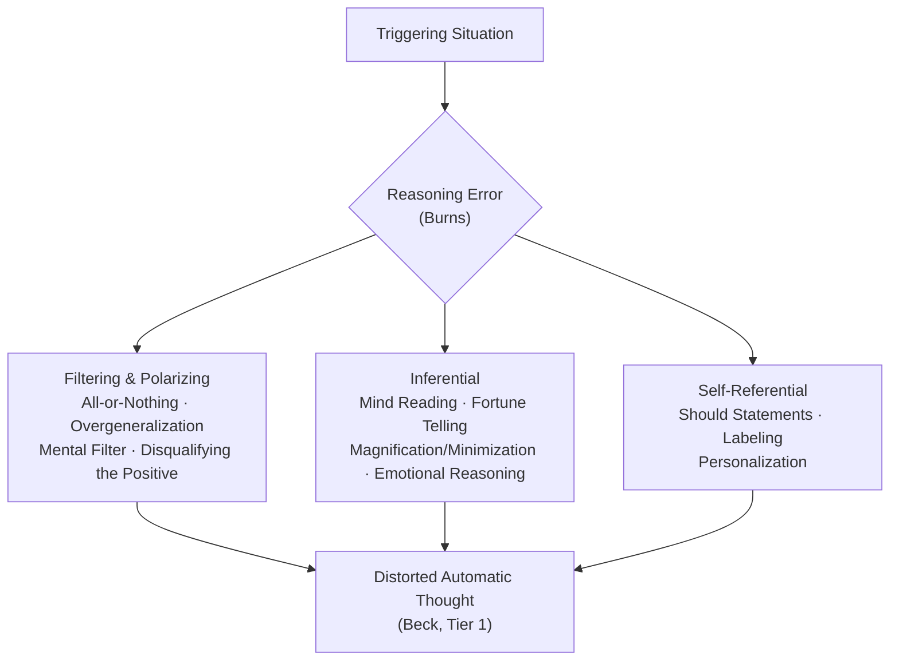
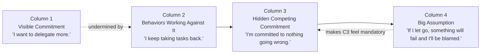

# Covenant Identity — Cognitive Diagnostic Fluency Curriculum

*Practitioner learning document, not a session tool. Purpose: build durable, transferable fluency in classifying a belief by depth and function (automatic thought vs. intermediate belief vs. core belief; schema domain; coping style; reasoning-error type; Big Assumption) — the skill directly underneath Stage 4a tool selection in [[Covenant Identity — Diagnostic Lens Transition Logic]]. Sequenced as a curriculum, not just a reading list, so the skill is retained and transfers to live material rather than decaying after one pass.*

---

## Why a Curriculum, Not Just a Reading List

Reading the source material once produces recognition, not fluency. Recognition is what lets you nod along when a concept is named for you; fluency is what lets you classify unlabeled, ambiguous, real-time client material correctly and quickly, under the actual pressure of a session. The two require different designs. This curriculum sequences exposure so the second is what actually develops — using the same drill architecture already proven in `/cic-fluency-drill` and `/cic-signal-drill`, retargeted from the CIC diagnostic-stage sequence to the underlying cognitive/schema taxonomy those stages draw on.

---

## Required Companion Reading

**[[Covenant Identity — Identity vs. Trigger-Activated Content — Psychological Frameworks Reference]]** is the core text for Phase 1 below and is not duplicated here. It already contains, in full professional (not compressed) form: Beck's complete Cognitive Conceptualization Diagram (core belief, intermediate belief, compensatory strategy, automatic thought) with a worked mermaid diagram; Young's schema/coping-style triad; and seven further frameworks (Spielberger, Markus, Bowlby/Ainsworth, Porges, Bower, Schwartz/IFS, McAdams) establishing the identity-vs-trigger-content distinction those two sit inside. Read it before Phase 1 below, which assumes it.

**[[Covenant Identity — Cognitive & Schema Diagnostic Taxonomy — Visual Reference]]** (below, this document) supplies the two visual mappings the Identity vs. Trigger-Activated Content document does not cover: Burns's full cognitive distortion taxonomy, and Kegan & Lahey's four-column Immunity to Change architecture. A companion HTML artifact recreates all four mappings (the two above plus these two) side by side for study: [Cognitive & Schema Diagnostic Taxonomy — Practitioner Reference](https://claude.ai/code/artifact/7f46fae3-832a-4d37-b203-8993f59ddbe8).

---

## The 5-Phase Curriculum

### Phase 1 — Conceptual Foundation (Declarative Knowledge)

Read in this order. Each source builds on the one before it; do not skip ahead.

| Order | Source | What It Establishes |
|---|---|---|
| 1 | [[Covenant Identity — Identity vs. Trigger-Activated Content — Psychological Frameworks Reference]] (required companion, above) | Beck's full model + Young's coping-style triad, inside the larger identity-vs-state distinction |
| 2 | Judith S. Beck, *Cognitive Behavior Therapy: Basics and Beyond* (3rd ed., 2020) | The primary clinical source for the model above — full technique detail, diagnostic markers for telling the tiers apart, correct downward-arrow procedure |
| 3 | Jeffrey Young, Janet Klosko & Marjorie Weishaar, *Schema Therapy: A Practitioner's Guide* (2003) | Full 18-schema taxonomy (cross-reference: [[Lie Eliminator — Schema Recognition Reference]]) plus schema *modes* — not yet in any vault document |
| 4 | David Burns, *Feeling Good Handbook* (rev. ed., 1999) | The ten cognitive distortions — see the Diagnostic Taxonomy visual reference below for the full professional-terminology version |
| 5 | Robert Kegan & Lisa Lahey, *Immunity to Change* (2009) | The full four-column architecture behind the Big Assumption Experiment already in CIC's Tool Library |
| 6 | Aaron T. Beck, Rush, Shaw & Emery, *Cognitive Therapy of Depression* (1979) | Denser theoretical grounding — the original schema construct and the ABC model, read for depth once the practical model is internalized, not before |

**Why this order, in pedagogical terms:** pairing each read with the diagram that represents its structure operationalizes **dual coding** (Paivio) — two independent memory traces (verbal + spatial) of the same structure encode more durably than either alone. This is why Phase 1 is "read + diagram together," not "read, then diagram later."

**Stopping point for Phase 1:** you can redraw all four frameworks' structures from memory (Beck's chain, Young's triad, Burns's distortion families, Kegan & Lahey's four columns) without referring to the source.

---

### Phase 2 — Worked-Example Study (Cognitive Load Management)

Before attempting any classification yourself, study several fully-worked examples per framework, spanning different content domains — not only performance/competence material, but also abandonment, control, and worth. Beyond the examples already in the companion reference and taxonomy visual, walk at least three additional automatic thoughts (your own or generic) all the way down the Beck chain, and re-express each resulting core belief in Young's, Burns's, and Kegan & Lahey's terms using the Integration table in the taxonomy visual reference.

**Why worked examples first:** per **cognitive load theory** (Sweller), asking a novice to learn the classification procedure and apply it simultaneously overloads working memory. Studying correct worked solutions before attempting your own produces faster, more accurate skill acquisition than practice-first approaches — this is the same reason `/cic-l1`–`/cic-l2` (orientation, mechanism) precede `/cic-l3` (diagnostic judgment) in the existing CIC practice sequence.

**Stopping point for Phase 2:** you can explain, for each of your three additional worked examples, which specific evidence in the material justified each tier/category call — not just state the answer.

---

### Phase 3 — Guided Retrieval Practice (Testing Effect)

Run `/cognitive-fluency-drill` (built alongside this curriculum) in single-framework mode: request one framework at a time (Beck, Young, Burns, or Kegan & Lahey) until each is independently fluent before moving to Phase 4.

**Why retrieval practice, not more reading:** per **Roediger & Karpicke (2006)**, active retrieval under uncertainty builds durable memory substantially better than repeated re-reading of source material — this is the exact mechanism the existing CIC drills already rely on, and why a sixth read of the taxonomy would be less effective than one scored drill session.

**Stopping point for Phase 3:** the drill's own stopping bar for each individual framework — at least several consecutive correct classifications with a named piece of evidence per call, not general instinct.

---

### Phase 4 — Interleaved Practice Across Frameworks

Run `/cognitive-fluency-drill` in mixed mode: vignettes drawn unpredictably across all four frameworks in the same session, requiring you to first decide *which lens applies* before classifying within it.

**Why interleaving, and why it feels harder:** per **Rohrer & Taylor (2007)**, blocked practice (all-Beck, then all-Young, then all-Burns) produces faster apparent mastery but weaker durable transfer. Interleaved practice is what builds the actual judgment skill required in a live session — choosing the right framework — because real client material never announces which framework applies the way a blocked drill session does.

**Stopping point for Phase 4:** the drill's interleaved-mode stopping bar (see the skill file) — correct framework selection *and* correct within-framework classification, sustained across a mixed run.

---

### Phase 5 — Transfer and Spaced Maintenance

Apply the classification skill first to your own automatic thoughts — Beck's own recommendation is that clinicians train the model on themselves before applying it to clients — then to live case material as it arises in actual CIC sessions. Re-run `/cognitive-fluency-drill` at increasing spaced intervals (not daily) rather than in one concentrated block.

**Why spacing, and why not daily drilling:** a single mastery pass reliably decays within weeks without later spaced retrieval — the same logic already flagged as a candidate addition in [[Lie Eliminator & Identity Installer — Adaptation Over Time (Design Proposal)]]'s spacing-effect discussion. Schedule re-drills rather than letting fluency quietly lapse.

**Stopping point for Phase 5:** there isn't one — this phase is maintenance, not mastery, and continues alongside live practice.

---

## Elicitation Technique — Running the Downward Arrow Correctly

*This section closes a gap Andrew flagged directly: the taxonomy above and in [[Covenant Identity — Identity vs. Trigger-Activated Content — Psychological Frameworks Reference]] tells you what layer a belief sits at once you have it in hand. It does not by itself tell you how to get from a surface automatic thought down to an accurate intermediate belief in live conversation — a distinct skill from classification, and the one that actually matters in a session. Practice this alongside Phase 2's worked examples, then drill it directly via `/cognitive-fluency-drill`'s Elicitation mode, which is separate from that skill's Phase 3/4 classification modes and tests the questioning sequence itself rather than classifying content already in hand.*

### The Failure Mode

The downward-arrow technique (Burns) is usually taught as one repeated question: "if that were true, what would it mean?" Asked repeatedly against an automatic thought, this question reliably bottoms out at Tier 3 — the core belief — because it is an *implication* question: it chases the consequence of a thought being true, all the way down to the most global, identity-level consequence available. What it does not reliably do is stop and surface Tier 2 on the way down. A client laddering "I botched that prep" through "what would that mean?" three times in a row typically lands on a core-belief statement without ever putting into words the rule that made the first slip feel so costly in the first place. The rung gets walked past, not found.

This matters diagnostically, not just academically: reaching only Tier 3 leaves only identity-level interventions available (declaration, schema work) — there is no access yet to the one thing that is actually testable behaviorally, which is the Tier 2 rule.

### The Corrective Move: Pivot to Compensatory Behavior

When continued "what would that mean" questioning has clearly reached Tier 3 without a clean Tier 2 statement along the way, stop laddering and ask a different kind of question — lateral, not deeper: **"What do you do — or refuse to do — to keep that from being confirmed?"**

This targets Beck's fourth element (Compensatory Strategy) directly. Once the behavior is named (over-preparing, avoiding visibility, controlling every variable), reverse-engineer the rule that makes that specific behavior necessary: **"For that behavior to feel non-negotiable, what would have to be true?"** The answer returns in exactly the conditional, if-then form Tier 2 requires — because that is the only form a rule can take.

### Why This Is Also Kegan & Lahey's Move

The "what do you do to prevent it" question is not a separate invention — it is Kegan & Lahey's Column 2 question (Behaviors Working Against the Visible Commitment), asked from the opposite direction. Run the full lateral sequence and the two frameworks' vocabularies translate directly onto each other:

| Move | Kegan & Lahey Slot | Beck Slot |
|---|---|---|
| "What do you do to prevent X?" | Column 2 — Behaviors Working Against It | Surfaces the Compensatory Strategy |
| "What is that behavior protecting?" | Column 3 — Hidden Competing Commitment | Names the motive behind the Compensatory Strategy |
| "For that to feel mandatory, what would have to be true?" | Column 4 — Big Assumption | **= Intermediate Belief (Tier 2)** |

**Practical instruction:** when a pure Beck-style downward arrow stalls — reaches Tier 3 with no clean Tier 2 en route, or the client can state the core belief but not any rule above it — switch frameworks rather than continuing to ladder. Run the Kegan & Lahey lateral sequence instead. The Big Assumption it produces is not a different belief from the missing intermediate belief; it is the same belief, reached by a route that doesn't skip past it.

### Diagnostic Markers — Confirming Tier 2 Has Actually Been Reached

A statement earns Tier 2 classification — rather than being a restated automatic thought, or a restated core belief wearing Tier 2's grammar — when it passes three checks:
1. **Grammatically conditional** — contains an "if/then," "must," or "have to," not a bare "I am" statement.
2. **Cross-situational** — the same rule can be shown to operate in at least one unrelated domain, not only the incident at hand. If it only explains this one situation, it is still an automatic thought in Tier 2's clothing.
3. **Explanatory** — removing it should measurably change the predicted intensity of the automatic thought. If the automatic thought would feel just as intense without this specific rule, the rule actually doing the work has not yet been found.

---

## Cognitive & Schema Diagnostic Taxonomy — Visual Reference

*The two mappings below fill the gap [[Covenant Identity — Identity vs. Trigger-Activated Content — Psychological Frameworks Reference]] does not cover. Both are also rendered, alongside recreations of that document's Beck and framework-map diagrams, in the companion artifact linked above.*

### Burns's Cognitive Distortion Taxonomy

David Burns's ten distortions describe characteristic *reasoning errors* — not a separate depth layer from Beck's model, but the mechanism by which a triggering situation gets converted into a distorted automatic thought. The three-family grouping below is an organizing convenience for study, not part of Burns's original published taxonomy — flagged as a design judgment, not a sourced claim.

**Full taxonomy, full definitions:**

| Distortion | Definition | Generic Example |
|---|---|---|
| All-or-Nothing Thinking | Evaluating in absolute, binary categories with no middle ground | "If it isn't perfect, I've failed completely." |
| Overgeneralization | Taking a single negative event as an endless, defining pattern | "This always happens to me." |
| Mental Filter | Dwelling on one negative detail until the whole picture darkens | One critical comment erases an hour of praise |
| Disqualifying the Positive | Rejecting positive evidence as not counting, for some reason | "That went well, but only because it was easy." |
| Jumping to Conclusions — Mind Reading | Assuming another's negative reaction without checking it | "They think I'm incompetent." |
| Jumping to Conclusions — Fortune Telling | Predicting a negative outcome as an already-settled fact | "This is going to go badly, I already know it." |
| Magnification / Minimization | Inflating a flaw or shrinking a strength out of proportion | A minor mistake becomes catastrophic |
| Emotional Reasoning | Treating a feeling as direct evidence of fact | "I feel like a fraud, so I must be one." |
| Should Statements | Fixed, rigid rules about how things must be, producing guilt or resentment | "I should have known better." |
| Labeling / Mislabeling | A fixed, global identity label instead of a description of the specific behavior | "I'm a failure," not "that attempt didn't work" |
| Personalization | Disproportionate personal responsibility for an event not fully within one's control | "The meeting ran long — that's on me." |

*(Eleven entries: Burns's original ten, with Jumping to Conclusions split into its two published sub-forms per the standard clinical presentation.)*

---

### Kegan & Lahey's Immunity to Change — Full Four-Column Architecture

Already deployed in CIC as the Big Assumption Experiment (see [[Five Intervention Modalities — Definitions & Deep Elaboration]] and [[Sanctification — ITC Practitioner Reference]]); reproduced here as its own standalone visual since the existing vault treatment references it in table form but doesn't diagram the causal architecture directly.

Column 3 is the key discovery: the person isn't failing at Column 1 — they're succeeding at a different, unstated goal, and that goal is protective, not sabotage. Column 4 is what makes that protective goal feel non-negotiable, and is the specific target of a low-risk behavioral experiment once named.

---

### Cross-Framework Integration Table

| Depth Layer | Beck | Young | Burns | Kegan & Lahey |
|---|---|---|---|---|
| Standing belief | Core Belief | Early Maladaptive Schema | *— not addressed at this layer* | The identity claim implicit beneath the Big Assumption |
| Conditional rule | Intermediate Belief | The unstated "if-then" logic inside each coping style | *— not addressed at this layer* | Big Assumption (Column 4) |
| Standing apparatus | Compensatory Strategy | Coping style — surrender / avoidance / overcompensation | *— not addressed at this layer* | Behaviors Working Against It (Col. 2), driven by the Hidden Competing Commitment (Col. 3) |
| Surface / momentary | Automatic Thought | A single triggered schema instance | The specific reasoning error shaping the automatic thought | *— not addressed at this layer* |

**Practical use:** when a belief won't resolve cleanly into a core-belief statement, re-approach it as a Big Assumption ("if X, then Y") — the conditional form is often easier to elicit and test behaviorally than the bare identity statement underneath it.

---

## Related Documentation

- [[Covenant Identity — Identity vs. Trigger-Activated Content — Psychological Frameworks Reference]] — required Phase 1 companion text
- [[Covenant Identity — Psychological Constructs — Reverse Connection Reference]] — CIC-system mapping this curriculum's frameworks connect to (Dysfunctional Core Beliefs, Cognitive Distortions entries)
- [[Covenant Identity — Diagnostic Lens Transition Logic]] — Stage 4a deploys the downward-arrow and thought-record techniques this curriculum builds fluency for
- [[Five Intervention Modalities — Definitions & Deep Elaboration]] — Big Assumption Experiment as deployed in CIC session work
- [[Lie Eliminator — Schema Recognition Reference]] — the 18-schema taxonomy this curriculum's Phase 1 Young reading maps against
- `/cognitive-fluency-drill` — the Phase 3/4 practice skill built alongside this curriculum
- `/cic-fluency-drill`, `/cic-signal-drill` — the existing CIC-specific drills this curriculum's practice design is modeled on

---

## Source Log

- Sweller, J. — Cognitive load theory; worked-example effect
- Roediger, H.L. & Karpicke, J.D. (2006) — Testing effect / retrieval practice
- Rohrer, D. & Taylor, K. (2007) — Interleaving effect
- Paivio, A. — Dual coding theory
- Bjork, R.A. — Desirable difficulties
- Beck, J.S. — *Cognitive Behavior Therapy: Basics and Beyond* (3rd ed., 2020)
- Beck, A.T., Rush, A.J., Shaw, B.F. & Emery, G. — *Cognitive Therapy of Depression* (1979)
- Young, J., Klosko, J. & Weishaar, M. — *Schema Therapy: A Practitioner's Guide* (2003)
- Burns, D. — *Feeling Good Handbook* (rev. ed., 1999)
- Kegan, R. & Lahey, L. — *Immunity to Change* (2009)
- Leahy, R. — *Cognitive Therapy Techniques: A Practitioner's Guide* (2nd ed., 2017)
- Ecker, B., Ticic, R. & Hulley, L. — *Unlocking the Emotional Brain* (2012)

*Built 2026-07-26 from a Claude conversation on identifying intermediate beliefs via the downward-arrow technique, extended at Andrew's request into a full learning curriculum. Not yet run live — Phase 3/4 stopping bars are design targets, not yet validated against actual drill sessions.*
