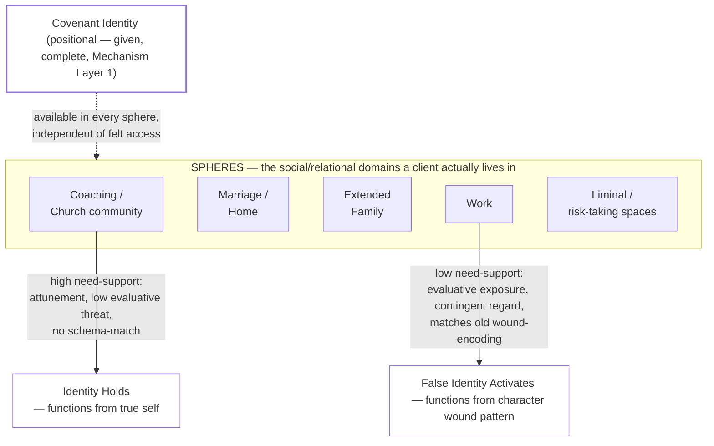

# Covenant Identity — Cross-Domain Identity Congruence — Psychological Frameworks Reference

*Practitioner reference and learning document — built for authorship reference and personal learning, not as a session tool, not client-facing, and not (yet) a formal CIC system component. Companion to [[Covenant Identity — Identity vs. Trigger-Activated Content — Psychological Frameworks Reference]], which addresses momentary, temporal activation (a trigger fires, a state activates, it recedes). This document addresses a related but distinct phenomenon: standing, sphere-linked patterns of identity functioning — a client whose covenant identity holds reliably in one social domain (church, coaching, close friendship) and collapses reliably in another (work, extended family, liminal or risk-taking contexts), session after session, not as a single triggered moment but as a recurring, domain-bound pattern.*

---

## The Core Distinction

A person's covenant identity is positionally singular and complete (Practice Definition, Dimension 1) — there is one true self, secured once, not many. But the *lived, functional experience* of that identity is not evenly available across every social context a person moves through in a given week. A client can be genuinely secure, non-defensive, and functioning from true identity in a coaching session or in prayer, and within the same day be functioning from a character wound pattern — performance, withdrawal, control — in a work meeting, a conversation with a parent, or a moment requiring relational risk. This is not hypocrisy, and it is not evidence the formation work "hasn't taken." It is a well-documented pattern with independent support across six psychological and sociological literatures, each naming a version of the same underlying mechanism: **identity is not uniformly accessible across social contexts — it is differentially available depending on the relational conditions each context provides, and the specific historical wound-content each context happens to match.**

The practical distinction from the companion document: Identity vs. Trigger-Activated Content asks *"what got activated just now, and how does it differ from identity?"* This document asks a prior, structural question: *"why does this client's false identity activate reliably in this sphere and not that one — and what would need to be true of a sphere for covenant identity to hold there instead?"*

### Visual Model

The same client, the same positional identity, two different spheres, two different functional outcomes — determined not by how "formed" the client is in the abstract, but by what each sphere's relational conditions happen to be and whether those conditions match the specific historical content of the client's wound.

---

## Framework 1 — Self-Schema Domain-Specificity (Markus)

Already load-bearing in the companion document. Markus's self-schema theory holds that self-knowledge is not one global structure but a set of domain-specific schemas, each chronically accessible only under the conditions that resemble its formation. A schema encoded as *"I am inadequate when evaluated by an authority figure"* will fire with high reliability in domains structured around evaluation by authority (performance reviews, a critical parent, a supervisor) and will not fire — or will fire much more weakly — in domains that don't recreate those conditions (a peer friendship with no evaluative structure, a worship context with no authority-comparison dynamic). **This is the base mechanism underneath everything else in this document:** cross-sphere disparity is not mysterious or evidence of shallow formation — it is what domain-specific schema activation predicts by default. The question a coach should be asking is not "why isn't this client's identity work holding," but "what about this specific sphere's structure matches this specific schema's encoding conditions."

---

## Framework 2 — Self-Concept Differentiation (Donahue, Robins, Roberts, & John, 1993)

This is the most directly on-point empirical literature for the phenomenon Andrew is asking about. Donahue et al. developed a measure of **self-concept differentiation** — the degree to which a person describes themselves differently across social roles (as a parent, as a worker, as a friend, as a son/daughter). Their finding, replicated and extended by later researchers: **higher self-concept differentiation correlates with lower psychological well-being, higher neuroticism, and lower identity integration**, both cross-sectionally and with some longitudinal support.

**The nuance that matters for CIC, and that must not be lost:** differentiation itself is not automatically pathological. Some role-appropriate behavioral variation is normal and healthy — a person reasonably speaks and acts differently in a business meeting than in a bedtime conversation with a child, and that flexibility is not a formation failure. What the research associates with poor outcomes is not *variation in behavior* but **fragmentation in the underlying sense of self** — the person doesn't merely *act* differently across roles, they experience themselves as discontinuous, without a stable core they can recognize as "me" moving between contexts. This is precisely the distinction the Whole-Person Identity Framework already draws between healthy role flexibility and the "Chaotic" pole of its Integration vs. Fragmentation section (Part 3) — this document supplies the specific empirical measure and finding behind a distinction the existing framework already asserts but does not source.

**Practical implication:** the coach's diagnostic target is not "does this client behave the same way in every sphere" (they shouldn't) but "does this client retain access to a stable, recognizable sense of who they are underneath the behavioral variation, or does the variation come with a felt loss of continuity — 'I don't know who I am at work' rather than 'I act differently at work.'" The first is normal role adaptation; the second is the diagnostic signal.

---

## Framework 3 — Role-Authenticity and Self-Determination Theory (Sheldon, Ryan, Rawsthorne, & Ilardi, 1997; Deci & Ryan)

This framework supplies the causal mechanism the correlational finding above (Framework 2) doesn't. Sheldon et al. measured Big Five trait expression across different roles (with parents, with friends, at work, with a romantic partner) and found two things directly relevant here: (1) trait expression *does* vary measurably by role — people are not behaviorally identical across contexts, confirming Framework 2's base finding — and (2) the roles in which people reported the *most* authentic functioning (trait expression closest to their own self-rated "true self") were the roles that scored highest on **need-support**, using Deci and Ryan's Self-Determination Theory framework: the degree to which a relational context supports **autonomy** (freedom from coercion or contingent approval), **competence** (a genuine sense of capability, not evaluative threat), and **relatedness** (felt connection, not performance for acceptance). Authenticity-in-role, in turn, predicted well-being in that role.

**Why this is the single most load-bearing finding in this document:** it means cross-sphere identity collapse is not primarily explained by "this sphere is unfamiliar" or "this client hasn't done enough work yet" — it is explained by **the measurable relational conditions of that specific sphere.** A sphere heavy on evaluative threat, contingent regard, and low relatedness will produce lower authenticity regardless of how formed the client is elsewhere, because the *mechanism* CIC itself already claims produces formation — Mechanism Layer 2's "attunement, relational honesty, and the coach's own formation posture create conditions in which the client can be genuinely known" — is precisely the need-supportive condition this literature identifies as the causal driver of authentic functioning. **The coaching relationship works, by this account, for the same reason some spheres in a client's life don't: it is unusually high in autonomy-support, competence-support, and relatedness-support compared to most ordinary social contexts a client inhabits.** This gives the coach a genuinely new diagnostic move: rather than treating "why does it hold in coaching but not at work" as a mystery, the coach can ask what specifically the coaching relationship supplies that the client's workplace does not, and use that comparison directly as session content.

---

## Framework 4 — Relationship-Specific Attachment Security (La Guardia, Ryan, Couchman, & Deci, 2000)

*[Verify citation details against the primary source before client-facing or published use — see frontmatter.]* This research extends attachment theory (already load-bearing via Bowlby/Ainsworth in the companion document) with a finding that directly complicates any assumption that "earned security" is a single global trait a person either has or doesn't. The finding: **attachment security varies measurably within the same person across different relationships**, as a function of how much autonomy-support each specific relationship provides — using the same Self-Determination Theory framework as Framework 3. A person can be functionally secure with a spouse or a coach and functionally insecure with a parent or a supervisor, not because their attachment history is inconsistent, but because security is partly a property of the *specific relationship's* conditions, not only a fixed internal trait carried into every relationship unchanged.

**Implication for CIC's own earned-secure-attachment framework** (see [[research_earned_secure_attachment_elements]] in memory — the Wallin/Fonagy/Main/Siegel four-mechanism synthesis): a client who is making genuine progress toward earned security through the coaching relationship should not be assumed to have thereby become globally secure. The coaching relationship's four mechanisms (corrective relational experience, reflective functioning, coherent narrative, embodied regulation) are being built *in that relationship specifically*, and this literature predicts that progress will generalize unevenly — fastest and furthest into spheres that share the coaching relationship's need-supportive structure, slowest into spheres that most resemble the original wounding conditions.

---

## Framework 5 — Role Identity Theory: Salience and Commitment (Stryker)

Stryker's identity theory (sociological, not clinical) proposes that a person holds multiple role-identities simultaneously (parent, employee, spouse, church member), organized in a **salience hierarchy** — how likely a given identity is to be activated across situations — which is itself a function of **commitment**: how much of the person's relational network and social standing is tied to that identity being enacted. An identity with deep relational commitment behind it (many people who know and relate to the person through that identity) becomes more chronically salient and more available across a wider range of situations than an identity with shallow commitment.

**Direct application:** a client's covenant identity may be highly salient and available in spheres where it is relationally reinforced — a coaching relationship, a small group, a spouse who actively relates to them as a beloved child of God — and much less available in spheres where *no one relates to them through that identity at all* (a workplace where nobody knows the client is a Christian, let alone relates to them through a covenant-identity lens). This is a structural, not merely psychological, account of why identity work "sticks" fastest in relationally reinforced spheres and generalizes slowest into spheres where the client's covenant identity has zero relational reinforcement. It gives formation-disciplines design (Mechanism Layer 5) a concrete lever: between-session practices that build relational reinforcement of covenant identity specifically *in the low-salience sphere* (a covenant-minded friend at work, a practice of naming true identity before entering a specific difficult family context) should, on this theory, do more than a generically-assigned discipline detached from the sphere where the disparity actually shows up.

---

## Framework 6 — Dramaturgical Self-Presentation (Goffman)

Goffman's sociological framework — self-presentation as performance, organized into "front stage" (managed, public-facing behavior) and "back stage" (unguarded, off-performance behavior) — is included here as an accessible descriptive vocabulary, not as an explanatory mechanism on par with Frameworks 1–5. It is useful primarily as a **caution**, not a diagnostic tool: Goffman's own account treats front-stage performance as a *normal, universal feature of social life*, not inherently a sign of a false self. Every person, formed or not, manages presentation differently in a job interview than alone with a spouse. A coach using this document should not treat "this client performs differently in public than in private" as identity distortion per se — that would misapply Goffman's own framework against its intent. The diagnostic question (per Framework 2 above) is whether the performance variation comes with a loss of the client's own felt continuity underneath it, not whether performance varies at all.

---

## Framework 7 — Subject-Object Domain-Unevenness (Kegan & Lahey, extended)

Kegan and Lahey's subject-object distinction is already load-bearing in the companion document for *momentary* activation (what a person is fused with and cannot see under stress, versus what they can hold as object and examine). Kegan's broader constructive-developmental work also documents that developmental order is not a single global achievement evenly available everywhere — a person can hold a structure as object in a domain where they have accumulated experience, feedback, and support (a seasoned professional's capacity for non-defensive critique *in their area of expertise*) while remaining subject to an earlier, more fused structure in a domain where they have neither (the same person's capacity to hold criticism non-defensively from a parent, or in a domain entirely new to them). Extended to spheres: a client can genuinely hold their covenant identity as object — examined, named, distinguished from the lie — in a sphere where they've done real formation work (a coaching relationship, a season of focused discipleship), and remain functionally subject to (fused with, unable to see past) an old wound-driven structure in a sphere the formation work hasn't yet reached. This is not regression; it is the normal, uneven texture of developmental growth, which is domain-specific by nature, not a single trait that generalizes instantly everywhere it's achieved anywhere.

---

## Theological Grounding

The phenomenon this document names is not a psychological import requiring theological justification after the fact — it is directly attested in Scripture, in figures whose covenant standing is not in question:

- **Peter** confesses Christ as the Son of God (Matt. 16:16) and, within hours, denies him three times under the specific social threat of a servant girl's question in a specific sphere — a hostile courtyard, physical danger, social exposure (Matt. 26:69–75). Same covenant identity, radically different functional outcome under a sphere-specific threat condition his confession-sphere never tested.
- **Abraham** — already a recipient of God's covenant promises — tells the same self-protective lie about Sarah in two different foreign courts, decades apart (Gen. 12, 20). A specific sphere (perceived vulnerability among foreign power) reliably activates the same failure pattern across a lifetime otherwise marked by real covenant faith.
- **Elijah** calls down fire on Mount Carmel in open, public confrontation with hundreds of prophets of Baal — then, one chapter later, collapses into isolated, suicidal despair in the wilderness after Jezebel's threat (1 Kings 18–19). Public confrontation and physical exhaustion/isolation are two different spheres with radically different outcomes for the same prophet in the same season of his life.

These examples establish, at **Fact level** (textual, not inferential), that Scripture itself depicts sphere-specific identity collapse in genuinely faithful covenant people — this is not a modern psychological category grafted onto the text; the text already shows it.

**Governing theological frame — formation, not correction:** The Practice Definition's already/not yet distinction (Dimension 1 — positional identity complete at new birth; identity *formation* present-tense and progressive) is the correct frame for this entire document, and it must not drift toward a correction posture. The telos is not "achieve congruence across every sphere" — that overclaims what Scripture promises this side of resurrection (Rom. 7's ongoing struggle; the model's own already/not yet tension) and quietly substitutes congruence-as-achievement for Christlikeness as the governing end. The correct formation-frame target, consistent with what the model already holds load-bearing, is: **increasing capacity to recognize where and why the gap opens, understand what a given sphere's relational conditions are doing, and practice covenant truth calibrated to that specific sphere** — not eliminating the disparity as a finish-line outcome. This is the same logic already built into the Whole-Person Identity Framework's "Gap Question" (the gap is diagnostic location, not failure) — this document extends that logic spatially, across spheres, rather than introducing a new standard the existing model doesn't already hold.

---

## The Common Pattern Across All Frameworks

Every framework above converges on the same structural claim from a different vantage point: **identity is not a fixed quantity uniformly deployed everywhere; it is differentially available depending on (a) whether a given sphere's relational conditions are need-supportive or threat-heavy, and (b) whether that sphere's specific structure happens to match the encoding conditions of a historical wound.** Markus names this at the level of cognitive schema content; Donahue et al. name it at the level of measurable self-concept variance and its correlation with well-being; Sheldon/Ryan and Deci/Ryan name the *causal* relational conditions (autonomy/competence/relatedness) that predict where authentic functioning is possible; La Guardia et al. extend the same causal account to attachment security specifically; Stryker names the structural/relational-commitment account of why some identities are chronically more available than others; Kegan and Lahey name the developmental-unevenness account. None of these treat cross-sphere disparity as evidence of shallow or failed formation — all six treat it as the *expected*, mechanistically explicable default, with genuine formation showing up not as instant universal generalization but as the client's growing capacity to name the pattern, understand the specific sphere's conditions, and practice truth there deliberately.

---

## Why This Matters for Intervention

This distinction determines **where the coach should direct attention when a client reports a sphere-specific struggle.** The wrong move is treating the disparity as evidence the client's formation work "isn't real" ("if your identity were truly secure, it would show up everywhere") — this is theologically unwarranted (see Theological Grounding above) and empirically backwards (differentiated functioning across roles is the normal human default, not a sign of deficient faith). The right move, per Frameworks 3 and 5 specifically, is treating the low-congruence sphere as a **distinct diagnostic and formation target in its own right**: what does this specific sphere's structure supply or withhold (autonomy, competence-affirmation, relatedness, relational commitment to the client's covenant identity), and what wound-encoding conditions does it happen to match? This reframes "why can't I hold onto this at work" from a discouraging verdict on the client's formation into a precise, answerable diagnostic question with a specific between-session formation target — consistent with Mechanism Layer 5's between-session disciplines being calibrated to a specific formation need, not generically assigned.

---

## Scope Boundary — Distinguishing Normal Role Variation from Dissociation

**This is a mandatory boundary, not an optional caveat.** "I am different depending on who I'm with" is, superficially, also a lay description consistent with dissociative identity presentations. This document's entire content addresses *normal, well-documented, non-pathological role and sphere variation* — every framework above (Markus, Donahue et al., Sheldon et al., La Guardia et al., Stryker, Kegan & Lahey) describes phenomena observed in ordinary, non-clinical populations. None of this document's content describes or licenses diagnosis of dissociation.

**A coach using this document must hold the distinction explicitly:**

- **Normal role/sphere variation** (this document's scope): behavioral and felt-security variation across spheres, *with the client retaining a continuous, recognizable sense of "this is me, functioning differently here"* even when the functioning itself is compromised. The client can, with reflection, name and own the pattern.
- **Dissociative presentation** (outside coaching scope — refer): reported loss of continuity of memory, identity, or consciousness across contexts; the client cannot, even with reflection, recognize or narrate the connection between how they function in different spheres; amnesia for behavior in one state while in another; a sense of being "taken over" rather than "acting differently under pressure."

Per the Whole-Person Identity Framework's existing Scope Boundary (Part 5): "any presentation requiring clinical assessment and treatment — depression, anxiety disorder, PTSD, **dissociation**" triggers referral, not coaching intervention. This document's cross-sphere language must never be used to explain away, minimize, or delay recognition of an actual dissociative presentation — if a client's account of "different in different spheres" includes memory discontinuity or a sense of being taken over rather than pressured, the referral protocol governs, not this framework.

---

## Diagnostic & Follow-Up Questions for Session Use

The Whole-Person Identity Framework already includes a sphere-differentiation probe under "Social self" (Part 4): *"Does how you act change depending on who's in the room? How?"* This document supplies the follow-up sequence that question currently lacks:

**Once a sphere-linked pattern is named:**
- "What's different about the conditions in that sphere — who's watching, what's at stake if you're fully seen there, what does that sphere require you to perform or prove?"
- "In the sphere where your identity holds most easily — what does that relationship or context give you that this other sphere doesn't?"
- "Does anyone in [the low-congruence sphere] relate to you as who you actually are in Christ — or is your covenant identity invisible there?"
- "When you're in [the low-congruence sphere] and the old pattern activates — do you still know, underneath it, that it's happening? Or does it feel like it's just who you are there?" *(Diagnostic for the normal-variation vs. dissociation boundary above — a "yes, I know, I just can't access it in the moment" answer indicates normal sphere-linked activation; an account of genuine disorientation about which is real warrants closer attention to the referral criteria.)*
- "What would it look like to practice reckoning with your true identity specifically before you enter that sphere, rather than only in sessions or in prayer removed from it?"

---

## Preview: Relationship to the CIC Architecture

*Preview only, not a completed formal mapping — flagged for future development if prioritized, in the same reverse-lookup format as [[Covenant Identity — Psychological Constructs — Reverse Connection Reference]].*

| Psychological/Sociological Construct (this document) | Functional CIC Parallel |
|---|---|
| Markus's domain-specific self-schema | The specific sphere-conditions under which a given **false identity / lie** reliably activates, as opposed to the lie's content itself (already covered in the companion document) |
| Donahue et al.'s self-concept differentiation vs. fragmentation | The distinction between healthy role adaptation and the "Chaotic" pole of the Whole-Person Identity Framework's Integration vs. Fragmentation section (Part 3) |
| Sheldon/Ryan and Deci/Ryan's need-supportive conditions (autonomy/competence/relatedness) | The same relational conditions Mechanism Layer 2 already claims the coaching relationship supplies ("attunement, relational honesty... conditions in which the client can be genuinely known") — named here as the reason some non-coaching spheres fail to support identity where the coaching relationship succeeds |
| La Guardia et al.'s relationship-specific attachment security | A caution against assuming progress toward earned security ([[research_earned_secure_attachment_elements]]) generalizes uniformly outside the relationship in which it was built |
| Stryker's role salience and commitment | The relational-reinforcement lever for between-session formation disciplines (Mechanism Layer 5) — identity holds fastest where it is relationally reinforced, slowest where no one in that sphere relates to the client through their covenant identity at all |
| Goffman's front stage / back stage | A caution against over-pathologizing ordinary self-presentation variation as identity distortion |
| Kegan & Lahey's domain-uneven subject-object shift | The developmental account of why holding identity "as object" in one sphere does not automatically transfer to another sphere where the client has neither experience nor support |

---

## Related Documentation

- [[Covenant Identity — Identity vs. Trigger-Activated Content — Psychological Frameworks Reference]] — companion document addressing momentary/temporal activation; this document addresses standing, sphere-linked activation patterns
- [[Covenant Identity — Whole-Person Identity Framework]] — governing anthropology; this document sources and extends the Relational/Social dimension, the Integration vs. Fragmentation section (Part 3), and the "Social self" diagnostic question (Part 4)
- [[Covenant Identity — Psychological Constructs — Reverse Connection Reference]] — companion construct→CIC mapping; a fuller construct-by-construct correspondence for this document's frameworks would follow that document's format if prioritized
- [[Covenant Identity — Character Wound Diagnostic Tool]] — Warrior/Hermit/False Noble typology; this document explains why a given wound type may present strongly in one sphere and be nearly invisible in another
- [[Covenant Identity — Crisis & Referral Protocol]] — governs the referral pathway when the Scope Boundary section above indicates a dissociative presentation rather than normal sphere variation
- [[Covenant Identity Coaching — Practice Definition]] — Dimension 1 (positional identity vs. identity formation) and Mechanism Layer 2 (coaching relationship as formation context) are the theological/structural anchors this document's formation-frame correction depends on
- [[Covenant Identity — Practitioner Reference Index]] — navigation entry point; index this document there under Theoretical Foundation

---

## Source Log / Evidence Levels

| Source | Evidence Level | Coaching Deployment |
|---|---|---|
| Markus, H. — Self-schema theory (1977) | Established personality/cognitive psychology | Already theoretical-deployment status per companion document; extended here to domain-specificity, same status |
| Donahue, E.M., Robins, R.W., Roberts, B.W., & John, O.P. (1993) — "The divided self: Concurrent and longitudinal effects of psychological adjustment and social roles on self-concept differentiation," *Journal of Personality and Social Psychology* | Established, peer-reviewed empirical finding (correlational and some longitudinal) | Theoretical — applied to coaching by conceptual transfer; not tested in a coaching-specific population |
| Sheldon, K.M., Ryan, R.M., Rawsthorne, L.J., & Ilardi, B. (1997) — "Trait self and true self: Cross-role variation in the Big-Five personality traits and its relations with psychological authenticity and subjective well-being," *Personality and Social Psychology Bulletin* | Established, peer-reviewed empirical finding | Theoretical — the causal need-support mechanism is the strongest single import in this document; not coaching-specific |
| Deci, E.L. & Ryan, R.M. — Self-Determination Theory (autonomy, competence, relatedness) | Extensively established, one of the most replicated frameworks in motivational psychology | Theoretical in this deployment — SDT itself is well-validated broadly, but its application to sphere-specific identity holding here is original synthesis, not independently tested |
| La Guardia, J.G., Ryan, R.M., Couchman, C.E., & Deci, E.L. (2000) — relationship-specific variation in attachment security | Believed established and peer-reviewed; **citation details unverified in this session — confirm before client-facing or published use** | Theoretical, pending citation verification |
| Stryker, S. — Identity theory (role salience, commitment) | Established sociological framework, decades of use and replication in social psychology | Theoretical — sociological/structural account, not experimentally validated in coaching contexts |
| Goffman, E. — *The Presentation of Self in Everyday Life* (1959) — dramaturgical self-presentation | Established, foundational sociological text | Descriptive/cautionary only — not used here as a diagnostic or intervention framework |
| Kegan, R. & Lahey, L. — Constructive-developmental theory, subject-object | Already load-bearing elsewhere in the CIC system (see companion document, [[Covenant Identity — Identity-Before-Behavior Research Foundation]]) | Theoretical — domain-unevenness extension is original synthesis for this document, consistent with Kegan's broader published observations on uneven developmental performance across domains |

*Implication for practice: the causal core of this document (Framework 3 — need-supportive conditions predicting authentic functioning) rests on well-established, peer-reviewed literature. The application of all seven frameworks to Covenant Identity Coaching specifically is original synthesis and has not been tested in coaching-specific populations or with CIC clients. Hold as practitioner-grade theoretical scaffolding, not as an empirically validated CIC protocol.*

---

*Built 2026-09-12 from a Claude conversation synthesizing established psychological and sociological literature at Andrew's request, following a /scrutinize stress-test of the underlying question. Not yet used live with a client. Not yet cross-checked against the full CIC construct correspondence in [[Covenant Identity — Psychological Constructs — Reverse Connection Reference]]. The La Guardia et al. (2000) citation requires verification before further use.*
