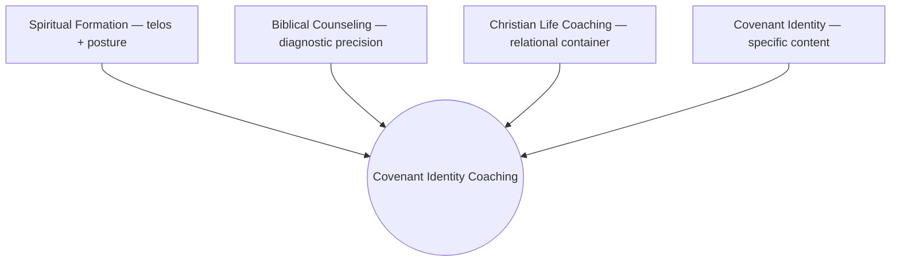
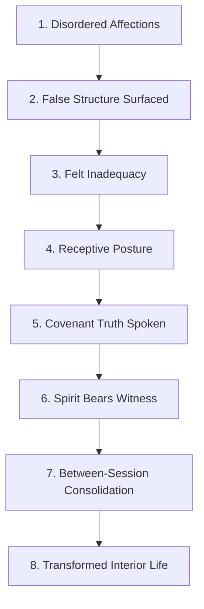
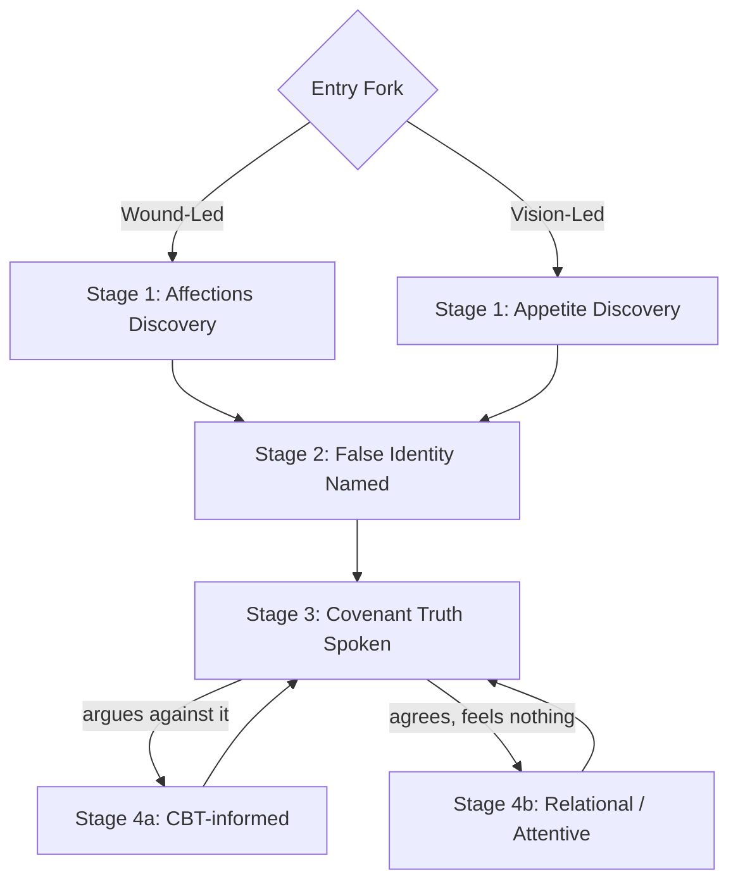
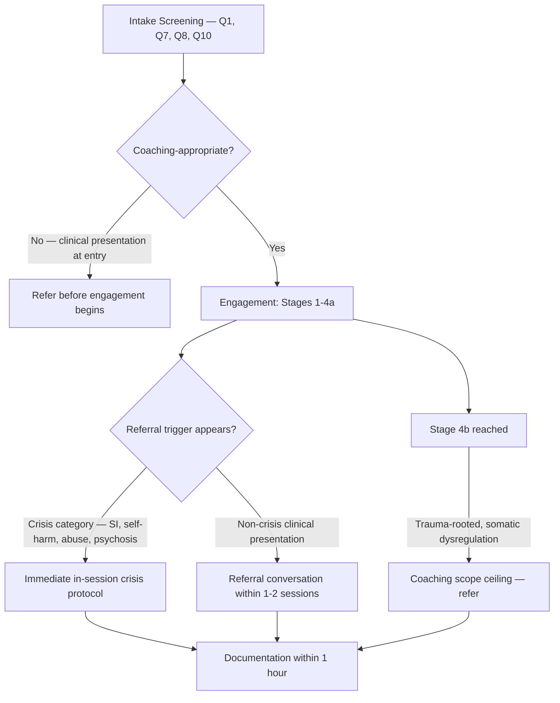

# Covenant Identity Coaching — Methodology & Readiness Review for Clinical Consultation
*Prepared for a first conversation with a licensed Christian mental-health professional — 2026-07-27*

*This document exists alongside a designed HTML presentation version (published as an Artifact) built from the same content. All Scripture ESV. This document is written for a different reader than* Covenant Identity Coaching — Peer Practitioner Briefing *— that one orients a fellow coach to how CIC works; this one is built for someone being asked to evaluate whether it works safely, and it leads accordingly with what is not yet resolved rather than with what has been built.*

**Presentation version:** https://claude.ai/code/artifact/d53e034f-ef6c-47c1-9cda-077ad93f3574

---

## 0. What This Document Is, and Why It Leads With What's Unfinished

You are being shown this because you may have interest in evaluating a coaching methodology I've built — Covenant Identity Coaching (CIC) — and because I would value your ongoing involvement as a clinical consultant to it, not just a one-time reader's reaction. Those two things shape how this document is organized.

A document meant to persuade you this is worth your time would lead with the architecture: the theology, the mechanism, the diagnostic precision. That material is real and Section 2 onward gives it to you in full. But if this document led with that, it would be asking you to evaluate a finished-looking system before telling you the one fact that should govern how you read everything else in it:

**This practice has not yet been used with a single live client.** Everything described below is designed and internally reviewed — including through repeated structured self-critique passes, some of which changed the design specifically because a risk was found (Section 4 gives examples) — but none of it has been tested against an actual person in an actual session. That is the starting fact, not a caveat buried at the end.

The reason I'm asking for your scrutiny now, before launch, rather than after: your evaluation is more useful applied to a design than to a track record I'd otherwise have to defend. And concretely, one of the gaps this document names in Section 6 — no established scope-boundary supervision relationship — is a gap your involvement could actually close, if this is work you find worth being part of.

---

## 1. Current State of Practice — Read This Before Anything Else

| | Status |
|---|---|
| **Live client sessions run to date** | Zero. Entirely pre-launch. |
| **Liability insurance** | In progress — being put in place before first client contact. |
| **Scope-boundary clinical supervisor** (licensed counselor/therapist or ACBC/CCEF-trained biblical counselor, reviewing actual case material on a recurring cadence) | Not yet established. This is the single largest open item in the practice's own pre-launch readiness plan, and the reason this conversation matters beyond a one-time review. |
| **Coaching-craft supervisor** (skills/alliance review, separate from clinical scope) | Not yet established. |
| **Referral network** (3–5 vetted local therapists, one trauma-focused, one depression/anxiety-focused, one faith-integrated) | Not yet built. |
| **QPR (suicide-prevention gatekeeper) training** | Required before first client contact; not yet confirmed complete. |

**What has been done:** the full methodology below, a complete diagnostic and session-tool architecture (Section 7 maps the supporting documents), a written crisis and referral protocol (Section 5), and multiple internal critique passes that found and fixed specific risks before anything was ever used on a person (Section 4 names two examples). What has not been done is anything that would let anyone — including me — claim this works. That claim can only be earned through supervised live use, which is exactly the sequence I'm trying to get right by having this conversation before, not after, first client contact.

---

## 2. The Three-Discipline Architecture

**One-sentence definition:** A structured, Spirit-cooperating coaching practice that surfaces false identity, applies covenant truth, and forms disciples toward faithful image-bearing in Christ through the practice of formation disciplines.

The model draws on three disciplines, in a specific and non-negotiable relationship. None is sufficient alone.

- **Spiritual Formation** governs the *telos* and the *posture* — the coach's operating stance is cooperation and attunement with what the Spirit is already doing, not technique-delivery or direct correction. Disciplines are conditions for transformation, not causes of it.
- **Biblical Counseling** provides *diagnostic precision* — idolatry and disordered worship as the root of false identity, the heart as the center of human functioning, and specific tools for surfacing affections, false identity, and character wounds.
- **Christian Life Coaching** provides the *relational container* — forward-oriented partnership, client agency, structured engagement, powerful questions, accountability.
- **Covenant Identity** (biblical theology) supplies the *specific content* of what the person is being formed toward — restored image-bearing, in Christ.

*Figure 1 — Three disciplines in ordered relationship. The biblical framework governs; coaching methodology is the delivery vehicle within it.*

CBT-informed tools are deployed selectively — only when a cognitive distortion is actively blocking reception of covenant truth (Stage 4a, Section 4). They are not the model's primary mechanism.

---

## 3. The Mechanism — Theory of Change

**The Gap.** Every client presents with a gap between declared covenant identity (what they confess theologically) and lived covenant identity (what they reach for under pressure, what they fear, what they trust). The heart is organized around a false covenant object — something other than God functioning as the operative source of security, significance, or worth.

*Figure 2 — The eight-node causal chain. Every tool in the system is anchored to a specific node. Node 6 is understood as God's act, not a technique's output — the coach's role there is to hold space, not manufacture a response.*

**The mechanism note at Node 5, stated in clinical terms because you should be able to evaluate it as such:** standard behavioral learning produces *extinction* — a new association suppresses the old one, but the original encoding survives and can return under stress. Memory reconsolidation (Nader & LeDoux, 2000; Schiller et al., 2010, *Nature*; clinical translation by Bruce Ecker) is structurally different: when a memory is reactivated, it briefly destabilizes and can be rewritten, not merely overridden. Three conditions are treated as required here: the implicit belief must be emotionally live; the client must encounter a felt disconfirmation, not merely an argued one; and the disconfirming experience must be held simultaneously with the activated belief.

I flag this specifically because it is the piece of the mechanism closest to clinical technique, and I want your read on whether the way it's operationalized in the session tools (Section 7) stays on the coaching side of the line, or whether any part of it functions as trauma-processing technique regardless of the label attached to it.

**Three failure modes the design guards against, named explicitly in the system's own governing documents:** legalism (disciplines as willpower applied to sin-identification), insight without formation (clarity without between-session practice), and tool dependence (treating tools as causes of transformation rather than conditions for it).

---

## 4. Diagnostic Architecture — and Where the Design Has Already Been Challenged

**Confirmed sequence:** [Wound-Led: Affections Discovery] or [Vision-Led: Appetite Discovery] → False Identity Named → Covenant Truth Spoken → Stage 4a (cognitive distortion blocking) or Stage 4b (implicit memory barrier blocking).

*Figure 3 — Session-level diagnostic sequence. Stage 4b — where the client receives covenant truth without resistance but nothing moves — is the coaching scope ceiling when it is trauma-rooted with somatic dysregulation. That is where referral protocol (Section 5) engages, not a place where the coach pushes deeper alone.*

Deepened, when an actual injury is present, by a Character Wound layer (Warrior/betrayal, Hermit/terror, False Noble/ambivalence) — a secondary diagnostic tool with its own per-type clinical referral triggers, explicitly scoped to apply only when a real injury, not diffuse conditioning, is present.

**Where this design has already had a risk found and fixed — offered so you can see how self-critique actually functions here, not just that it's claimed:**

1. A tool addressing sin at the implicit-belief level was originally drafted as a client-facing checklist distinguishing categories of wound-linked sin. A structured critique pass concluded that version was unsafe — it risked self-typing and identity-collapse in the client's own hands. The tool was rebuilt as a coach-narrated, in-session-only prayer sequence where the client never sees the typology, the wound-sin categories, or the underlying exegesis — those stay coach-side. It has not yet been used with a live client, so whether the redesign actually resolves the risk in practice, not just on paper, is still open.
2. Two Stage-4b session documents were reviewed after being built and found to have a live safety gap each: one lacked a mid-session check for whether the client was still emotionally activated before a declaration was spoken (risking a hollow declaration landing on a faded state); the other — a fully self-guided, no-coach-present version — lacked a mid-exercise safety check for a client working alone. Both gaps were named; the fix pass on the second is still pending.

I'm surfacing these not because the record is bad — internally, this is the system working as intended — but because you should know self-critique here has already changed the design at least twice, and because it tells you what kind of scrutiny would actually be useful from you: not "is this theologically coherent" (Section 2–3 make that case, and I'd welcome your read on it too), but "where does this still put a client at risk that internal review hasn't caught, because internal review isn't the same as clinical training."

---

## 5. Scope Boundary & Safety Architecture

### What this is, and is not

| | Therapy | Covenant Identity Coaching |
|---|---|---|
| Diagnoses / treats clinical conditions | Yes | No — refers out |
| Processes trauma directly | Yes, when indicated | No — Stage 4b is the scope ceiling; refers when trauma-rooted |
| Uses psychological frameworks | As primary treatment modality | As diagnostic vocabulary only — Scripture governs |
| Entry population | May include active clinical presentation | Formation-ready, non-clinical baseline required |

### Referral triggers — condensed from the full Crisis & Referral Protocol

**Non-crisis referral (conversation within 1–2 sessions of recognition):** active major depressive episode, active anxiety disorder, trauma requiring clinical processing (PTSD symptoms, complex developmental trauma), eating disorder behaviors, active substance dependence, bipolar presentation, psychotic-spectrum symptoms, severe dissociation, spiritual abuse with active trauma symptoms, religious scrupulosity, and scope-creep signals (crisis-level between-session contact, wound material destabilizing daily functioning, no movement across multiple sessions, the coach genuinely out of depth).

**Immediate crisis protocol (Section 4 of the full document governs in-session response):** suicidal ideation (triaged via the Columbia Suicide Severity Rating Scale — passive ideation through active ideation with plan and intent, each with a specified response up to calling 988 or 911), current self-harm, acute trauma response / flooding / severe dissociation in session, disclosure of current or historical abuse, and active psychotic presentation.

*Figure 4 — Scope Boundary & Referral Map. This diagram is my own synthesis, assembled from three separate source documents (the Crisis & Referral Protocol's trigger list, the diagnostic sequence's Stage 4b ceiling, and the Character Wound tool's per-type triggers) rather than reproduced from any single one. I'd specifically welcome your eye on whether this map has gaps the source documents don't individually surface.*

### Readiness gap status

| Gap (identified 2026-07-04) | Status |
|---|---|
| No remote-client location / emergency-contact capture at intake | Closed — added to the intake form 2026-07-06 |
| No established scope-boundary supervision relationship | **Open — this is the gap this conversation is meant to help close** |
| No liability insurance requirement in the pre-launch checklist | In progress |
| No refresh cadence on the referral list | Open — minor, checklist-level, not yet built |

---

## 6. What Constructive Scrutiny Would Look Like

- Where does this cross into clinical scope in your judgment, in places the Crisis & Referral Protocol or the Stage 4b scope ceiling don't already catch?
- Are there referral triggers missing — particularly around the implicit/relational work in Stage 4b, or the Character Wound typology's per-type clinical flags?
- Looking at Section 3's mechanism note and Section 4's Stage 4b description specifically: does any of this function as trauma-processing technique in practice, regardless of what it's called?
- Would an ongoing consulting relationship be something you'd consider — reviewing actual case material (recordings or transcripts, not self-report) on a recurring cadence, once there is case material to review? If so, what would that need to look like from your side — cadence, format, documentation, and how liability and confidentiality should be structured between us?

---

## 7. Support File Map

*The same document architecture referenced throughout this review, reordered here to put the diagnostic and safety layer first — the layer most relevant to your evaluation — rather than leading with the model-foundation layer, as the coach-facing version of this map does.*

| Layer | Key documents | What they're for |
|---|---|---|
| **Diagnostic Architecture & Safety** (`06 — Practitioner Reference`) | Crisis & Referral Protocol (full document — scope of practice, referral triggers, C-SSRS triage, in-session protocol, documentation requirements) · Diagnostic Lens Transition Logic (full Stage 1–4b sequence, entry/exit signals) · Character Wound Diagnostic Tool (per-type clinical referral triggers) · Stage 4b Implicit Level Practitioner Reference (scope boundary, five referral signals) · Pre-Practice Readiness Action Plan (current gap status) | Everything governing where coaching stops and clinical care starts |
| **Model Foundation** (`01 — Model Foundation`) | Practice Definition · Theory of Change · Manifesto · Full Model Reference · Theological-Formation Contributor Stack | The governing theological and mechanism layer |
| **Session Tools** (`04 — Session Tools`) | Discovery Call Guide · Phase 1–4 Session Tools · Witnessing Repentance — Session Worksheet · Parts & Burden Discovery — Session Worksheet | Session-by-session structure; includes the two tools referenced in Section 4's self-critique examples |
| **Between-Session Library** (`08 — Between-Session Materials`) | Between-Session Distress Protocol · Between-Session Library — Design Rationale · What the Part Carries — An Independent Formation Practice | Client-facing material used between sessions, including the self-guided tool referenced in Section 4 |
| **Practitioner Development** (`06 — Practitioner Reference`) | Practitioner Competency Framework · Self-Supervision Template · Diagnostic Calibration Log | Coach formation and diagnostic-accuracy tracking |
| **Full Navigation** (Root) | Document Reading Order (109 documents, 9 blocks) · System Document Master List · COMPLETE SYSTEM REFERENCE | The complete index, if you want to go deeper than this review into any specific piece |

---

## Closing

I'm not asking you to endorse this. I'm asking you to look at it closely enough to tell me where it's wrong, incomplete, or riskier than I've represented — and to consider whether an ongoing relationship doing that would be something you'd want to take on.
