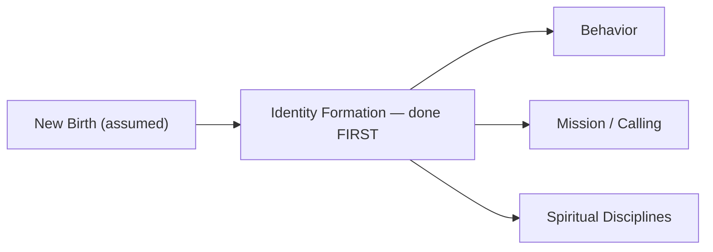
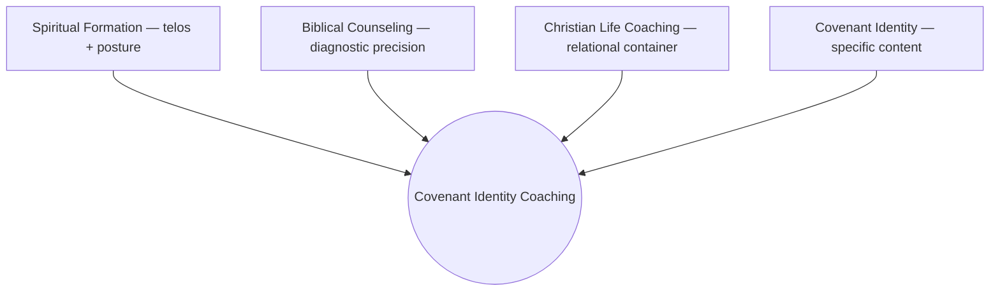
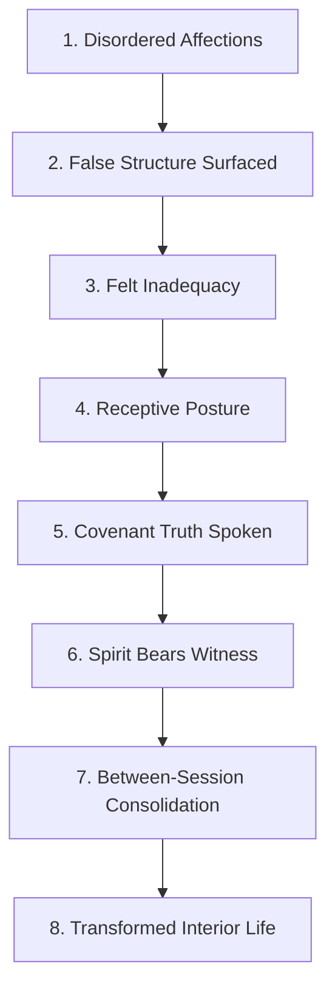
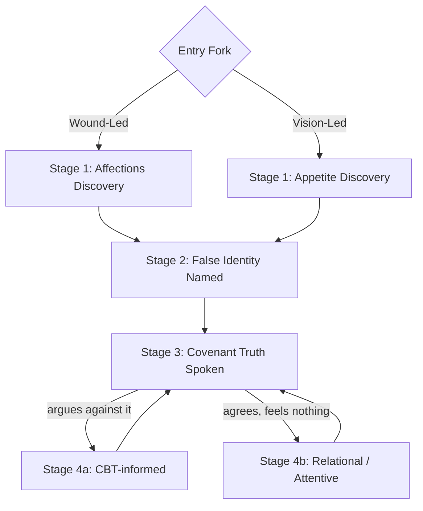

# Covenant Identity Coaching — Peer Practitioner Briefing
*Prepared for a conversation between practitioners — 2026-07-14*

*This document exists alongside a designed HTML presentation version (published as an Artifact) built from the same content, formatted for live reading and screen-sharing. This file is the archival record of that content. All Scripture ESV.*

**Presentation version:** https://claude.ai/code/artifact/05d05db3-fc9c-457d-bf5a-c68d8e2507b5

---

## 1. Where This Begins — The Biblical Foundation

This model was not assembled by taking a coaching methodology and adding Bible verses to it. It was built the other direction: starting from what Scripture says about where transformation happens, and only then asking what coaching methodology and psychological description could serve that claim. This section states the biblical case first, in Scripture's own words, because that is the actual order in which the model was built — and because it is the order that determines everything that follows.

### The covenant grammar: identity declared before behavior required

Every covenant God makes with His people follows the same structure. He states who He is and what He has already done — then, and only then, comes the command:

> *"I am the LORD your God, who brought you out of the land of Egypt, out of the house of slavery. You shall have no other gods before me."* (Exodus 20:2–3)

The indicative precedes the imperative. Identity and rescue are declared first; the command follows as the natural shape of a life already claimed, not the price of admission to being claimed. This is not one instance among many — it is the grammar of the entire covenant relationship between God and His people, and it is the structural argument for why this model treats identity, not behavior, as the primary terrain.

### Christ's own mission statement: the inner man, named first

When Jesus stood in the synagogue at Nazareth and announced what He had come to do, He read this:

> *"The Spirit of the Lord GOD is upon me, because the LORD has anointed me to bring good news to the poor; he has sent me to bind up the brokenhearted, to proclaim liberty to the captives, and the opening of the prison to those who are bound..."* (Isaiah 61:1–2)

Luke records Him reading a version of this text and applying it directly to Himself:

> *"The Spirit of the Lord is on me, because he has anointed me to proclaim good news to the poor. He has sent me to proclaim liberty to the captives and recovering of sight to the blind, to set at liberty those who are oppressed, to proclaim the year of the Lord's favor."* (Luke 4:18–19)

> *"And he rolled up the scroll and gave it back to the attendant and sat down... And he began to say to them, 'Today this Scripture has been fulfilled in your hearing.'"* (Luke 4:20–21)

Worth being precise about, for a fellow practitioner: Luke's quotation is a composite. It draws the "liberty to the captives" and "recovering of sight to the blind" language from Isaiah 61:1, but "to set at liberty those who are oppressed" is drawn from Isaiah 58:6 — a different oracle, about true fasting, that Jesus fuses into His mission statement. Whatever textual tradition one reads, the content of both oracles is the same category of thing: captivity, oppression, brokenness of heart — internal conditions, not merely external circumstance. When Jesus states His own mission in His own words, at the outset of His public ministry, this is where He points. The inner condition of a person is not a secondary concern He gets to eventually. It is named first.

### The inner man, named directly

Paul does not treat this as metaphor. He names the inner and outer self as distinct categories, and locates the site of ongoing transformation specifically in the inner one:

> *"So we do not lose heart. Though our outer self is wasting away, our inner self is being renewed day by day."* (2 Corinthians 4:16)

> *"...that according to the riches of his glory he may grant you to be strengthened with power through his Spirit in your inner being..."* (Ephesians 3:16)

### The new covenant promise: a new heart, not new information

The prophets describe the New Covenant itself — the covenant Christians actually stand inside — as a transformation of the heart, not an upgrade of instruction:

> *"And I will give you a new heart, and a new spirit I will put within you. And I will remove the heart of stone from your flesh and give you a heart of flesh. And I will put my Spirit within you, and cause you to walk in my statutes and be careful to obey my rules."* (Ezekiel 36:26–27)

> *"For this is the covenant that I will make with the house of Israel after those days, declares the LORD: I will put my law within them, and I will write it on their hearts. And I will be their God, and they shall be my people."* (Jeremiah 31:33)

Notice the order in Ezekiel again: new heart and new Spirit *first* — obedience to the statutes follows *from* that, as its result, not its cause. And notice what changes: not the content of the law, but the location where it takes root. This is the same grammar as Exodus 20 and the same claim as Isaiah 61 — the inner man is where God does His defining work, and the rest follows from there.

Paul names the ongoing shape of that same work in the believer's present life:

> *"And we all, with unveiled face, beholding the glory of the Lord, are being transformed into the same image from one degree of glory to another. For this comes from the Lord who is the Spirit."* (2 Corinthians 3:18)

**These texts converge on a single claim, and it is the claim this whole model is built on:** the primary terrain of Christian transformation is the inner man — the heart, the affections, the felt and operating identity — not behavior considered first and identity assumed to follow. That is not a psychological insight Scripture happens to confirm. It is where Scripture starts, and it is where this model starts.

### Whose mission this is now

Christ names this mission as His own in Luke 4:18–21. But He does not keep it. He commissions the Ecclesia to carry it forward:

> *"As the Father has sent me, even so I am sending you."* (John 20:21)

> *"But you will receive power when the Holy Spirit has come upon you, and you will be my witnesses..."* (Acts 1:8)

Paul describes his own apostolic commissioning in the same Isaiah 61 vocabulary Christ used of Himself — blindness, darkness, captivity:

> *"...to open their eyes, so that they may turn from darkness to light... that they may receive forgiveness of sins..."* (Acts 26:18)

This is not a claim that the church repeats Christ's fulfillment — Luke is precise that the fulfillment was singular and already accomplished ("today," Luke 4:21). It is a claim of inheritance: the church, as Christ's body (1 Corinthians 12:27; Ephesians 1:22–23), continues the same mission under the same Spirit, in derivative and participatory form — not a second messianic act.

Isaiah 61 and 58 name both inward conditions (the brokenhearted, the captive in heart) and outward ones (the poor, the physically bound, the oppressed). The Ecclesia inherits both. Covenant Identity Coaching does not claim both — consistent with Section 8's boundaries, its scope is the inward register only. What this model claims is narrower and more precise: that "binding up the brokenhearted" and "liberty to the captives" is not metaphor in this mission statement — it is a literal mandate covering the interior life, and CIC is one disciplined way the church carries out that specific piece of what it was handed.

---

## 2. Identity Formation — The First Developmental Task

### This assumes new birth. That is the starting condition, not the subject.

This model, and this document, begin *after* new birth. Whether and how regeneration happens is a real and important question — it is simply not this document's question. It is assumed the way a physician assumes a living patient before treating an illness. A person walking into a Covenant Identity Coaching engagement is assumed to already be in Christ. What happens from there is what this model addresses.

### The telos is offered — not required of everyone alike

This matters enough to state directly: *telos* — the end or ultimate purpose something is designed to reach, used here rather than a looser word like "goal" because it carries the sense of a built-in destination, not a preference chosen along the way — is not a universal bar everyone is expected to clear. The interior life this model moves a person toward is covenant-specific content — available *inside* the covenant relationship God establishes at new birth. A person who is not yet in Christ is not being asked to produce this telos on their own, and nothing is being demanded of them that they have no access to. The telos is a gift extended within a relationship, not a general requirement imposed on everyone regardless of standing. Believers have this offered to them specifically *because* they are already inside the covenant — not because they have earned or achieved anything further.

### Positional identity vs. identity formation — a distinction that changes everything

Two things must not be collapsed into one.

**Positional identity** is the objective, already-accomplished reality conferred at new birth and union with Christ — instantaneous, complete, and entirely the Spirit's act, not the client's achievement or the coach's production. Scripture states this as a finished fact, in the past tense:

> *"We know that our old self was crucified with him..."* (Romans 6:6)

> *"For you have died, and your life is hidden with Christ in God."* (Colossians 3:3)

> *"Therefore, if anyone is in Christ, he is a new creation. The old has passed away; behold, the new has come."* (2 Corinthians 5:17)

**Identity formation** — what this practice actually does — is the Spirit-enabled, cooperative process of bringing the client's conscious self-understanding, felt sense of self, and affections into alignment with a positional reality that is *already theirs*. This is present tense and progressive:

> *"...to put off your old self, which belongs to your former manner of life and is corrupt through deceitful desires, and to be renewed in the spirit of your minds, and to put on the new self, created after the likeness of God in true righteousness and holiness."* (Ephesians 4:22–24)

The coaching work is not building an identity that doesn't yet exist. It is closing the distance between a status already secured and a life not yet lived from it.

### Why identity has to be the first thing developed — not behavior, not mission, not disciplines

If identity is already true positionally, why does it need to be *developed* at all, and why first? Because the client's felt, operating self does not automatically catch up to a status conferred instantaneously — and every other developmental category (behavior, mission, spiritual disciplines) is downstream of which self the person is actually living from in the moment they attempt it.

Scripture states the ordering directly — the "put off / put on" language is never given as a free-floating behavioral instruction; it is always grounded in what has *already* happened to the person:

> *"Do not lie to one another, seeing that you have put off the old self with its practices and have put on the new self, which is being renewed in knowledge after the image of its creator."* (Colossians 3:9–10)

A behavioral instruction ("do not lie") is grounded in an identity claim already stated as accomplished ("you have put off... put on"). Behavior is the fruit of that identity, not the path to it.

This is not only a theological claim; it is independently corroborated across several unrelated research traditions in psychology — named here not because the psychology governs the claim (Section 7 addresses that directly), but because a psychologically literate audience should know this isn't a special pleading unique to this model. William Swann's decades of research on self-verification shows that people actively filter incoming information to preserve coherence with their existing self-concept — meaning covenant truth spoken to an unrevised identity gets filtered rather than received as evidence. Robert Kegan and Lisa Lahey's Immunity to Change research shows that behind every failed behavioral change is a competing commitment protecting an identity claim — the person is not failing to change; they are succeeding at protecting who they believe themselves to be. Dan McAdams's narrative identity research shows that behavior conforms to a person's governing life story over time, and that durable change requires revising the story itself, not just adding new behavioral data to the old one. Independently, and for different reasons, these traditions converge on the same finding Scripture states first: identity-level work is not a supplement to behavioral change. It is the precondition for it.

**Identity formation is therefore the first work of this model** — prior to behavior change, prior to mission and calling work, prior to spiritual disciplines being assigned for their own sake. Those are real and necessary, and this model addresses all three in Phase 3 and Phase 4 — but as what flows *from* a formed identity, not as the ground it's built on.

*Behavior, mission, and disciplines are what flows from a formed identity — not the ground the model starts on.*

---

## 3. What Covenant Identity Coaching Is

**One-sentence definition:** A structured, Spirit-cooperating coaching practice that surfaces false identity, applies covenant truth, and forms disciples toward faithful image-bearing in Christ through the practice of formation disciplines.

The model draws on three disciplines, in a specific and non-negotiable relationship. None of the three is sufficient alone.

- **Spiritual Formation** governs the *telos* and the *posture* — "posture" meaning the coach's operating stance, not a technique: cooperation and attunement rather than technique-delivery or direct correction. The client is being formed by the Spirit toward restored image-bearing; the coach cooperates with what the Spirit is already doing; disciplines are conditions for transformation, not causes of it.
- **Biblical Counseling** provides *diagnostic precision* — idolatry and disordered worship as the root of false identity, the heart as the center of human functioning, and specific tools for surfacing affections, false identity, and character wounds.
- **Christian Life Coaching** provides the *relational container* — forward-oriented partnership, client agency, structured engagement, powerful questions, accountability.
- **Covenant Identity** (biblical theology, Section 1 and 2 above) supplies the *specific content* of what the person is being formed toward.

**Governing hierarchy — not four co-equal ingredients stirred together.** The biblical framework is the governing lens and interpretive authority. Spiritual formation is the practitioner's posture. Coaching methodology is the delivery vehicle, operating within and through that framework. CBT-informed tools are deployed selectively — only when a cognitive distortion is actively blocking reception of covenant truth. Scripture determines what identity is, what has gone wrong, and what renewal looks like. Everything else is instrumental to that — a point Section 7 makes explicit and defends.

---

## 4. The Mechanism — Theory of Change

**The Gap.** Every client presents with a gap between declared covenant identity (what they confess theologically) and lived covenant identity (what they reach for under pressure, what they fear, what they trust). The heart is organized around a false covenant object — something other than God functioning as the operative source of security, significance, or worth.

**The eight-node causal chain:**

Node 6 is the hinge of the whole model, and it is worth quoting rather than paraphrasing:

> *"The Spirit himself bears witness with our spirit that we are children of God."* (Romans 8:16)

Nodes 1–5 create the space. Node 6 is not a technique's output — it is God's act, and the practitioner's job at this node is to hold space, not manufacture a response.

**The mechanism note on Node 5 — for a psychologically literate audience specifically.** Standard behavioral learning produces *extinction*: a new association suppresses the old one, but the original encoding survives and returns under stress. Memory reconsolidation (Nader & LeDoux, 2000; Schiller et al., 2010, *Nature*; clinical translation by Bruce Ecker) is structurally different: when a memory is reactivated, it briefly destabilizes and can be *rewritten*, not merely overridden. Three conditions are required — the implicit belief must be emotionally live; the client must encounter a felt disconfirmation, not merely an argued one; and the disconfirming experience must be held simultaneously with the activated belief.

This is the theoretical answer to "I know it in my head, but I don't feel it in my heart" — not a spiritual failure, but an accurate description of extinction-mode processing: the truth arrived before the false belief was live, so it landed in explicit memory rather than replacing anything. Declaration and covenant truth work — durably — when they meet an activated implicit belief with lived, felt disconfirmation.

**Three failure modes the mechanism guards against:** legalism (disciplines as willpower applied to sin-identification), insight without formation (clarity without between-session practice), and tool dependence (treating tools as causes of transformation rather than conditions for it).

---

## 5. Diagnostic Architecture — The Session-Level Sequence

**Confirmed sequence:** [Wound-Led: Affections Discovery] or [Vision-Led: Appetite Discovery] → False Identity Named → Covenant Truth Spoken → Stage 4a (cognitive distortion blocking) or Stage 4b (implicit memory barrier blocking).

**Entry Fork — read once, at Discovery Call or early Phase 1.** Wound-Led (the default) means the client names a presenting cost. Vision-Led means the client names no presenting cost but expresses genuine desire to grow deeper with God and is willing to be diagnosed anyway. Both doors reach the identical outcome — a specifically named functional dependency. A **Lateral Reroute Signal** guards the Vision-Led door: if "growth-seeking" turns out to be compulsive, KPI-tracked, or performed for an audience, that growth-seeking *is* the false covenant object, and the client is rerouted to Wound-Led work rather than having a compulsive pattern coached and resourced under a spiritual-growth banner.

**Stage 1 — Affections Discovery.** Surfaces what the client is actually trusting for security, significance, or identity. Deepened, when an actual injury is present, by a Character Wound layer: Warrior (betrayal), Hermit (terror), False Noble (ambivalence).

**Stage 2 — False Identity Named.** Named specifically: "I am only safe when I am accepted," not "you seem to perform for approval." Two conditions required before moving on: the false structure is precisely exposed, *and* felt inadequacy is present — grief or weariness directed at the structure itself, not just intellectual concession.

**Stage 3 — Covenant Truth.** What God says about who the client actually is, spoken directly against the named false identity — verified against the activation requirement from Section 4 before it's spoken.

**Stage 4a — CBT-informed.** Triggered when the client actively argues against the truth. Coach-safe tools: Socratic questioning, laddering, thought records, behavioral experiments. Serves the covenant work; returns to Stage 3 once the distortion loosens.

**Stage 4b — Relational and attentive response.** Triggered when the client receives the truth without resistance but nothing moves — the identity is held below where cognitive tools reach. The coach adds no more content; the coach becomes more present — slows down, speaks personally rather than propositionally, returns to the same truth across sessions. When trauma-rooted with somatic dysregulation, this is the coaching scope ceiling — referral protocol engages.

---

## 6. The Four-Phase Engagement

| Phase | Sessions | Primary Work |
|---|---|---|
| **1 — Covenant Orientation** | 1–2 | Gap naming, God-representation surfacing, designed alliance |
| **2 — Wound Mapping** | 2–4 | Schema excavation, Immunity to Change mapping, lament introduction |
| **3 — Identity Installation** | 4–8 | Targeted declaration, schema interruption, narrative re-authoring, implicit-level work |
| **4 — Mission & Fruitfulness** | 8–10 | Consolidation, telos work, rule of life, Growth Report |

Note the order: identity installation (Phase 3) precedes mission and fruitfulness (Phase 4) — the same sequence argued for in Section 2, now built into the engagement structure itself.

---

## 7. Why This Isn't Eclecticism — The Integration Rationale

A fair challenge to any model this conversant with psychology: is Scripture actually governing, or is this psychology with verses attached afterward? Sections 1 and 2 already answer this by showing where the model actually starts. This section makes the governing rule explicit.

The position is Eric Johnson's *Christian psychology* — distinct from biblical counseling's "Scripture only," from classic integration's "psychology and theology as co-equal sources," and from "levels of explanation." Psychology is evaluated against a Christian anthropology and used only where consistent with or illuminating of what Scripture already says.

**Two admission criteria, applied to every contributor:**
1. **Confirmatory** — psychology independently observes what Scripture already states. Adds vocabulary, no new content.
2. **Additive** — psychology describes a mechanism Scripture assumes but doesn't explain at a developmental or neurological level. Requires verifying the mechanism doesn't smuggle in a competing anthropology.

**What's explicitly excluded, even from contributors otherwise used:** Dan Siegel's telos (neural integration as flourishing) is not imported — Scripture defines flourishing as conformity to Christ. Curt Thompson's shame-as-organizing-root is not imported — shame is a signal pointing toward the covenant object underneath, not the root itself. Internal Family Systems' assumption that "Self" is an inherently whole, self-generated core is rejected and re-grounded: in this model, Self is the *new self in Christ* (Galatians 2:20 — *"It is no longer I who live, but Christ who lives in me"*) — Spirit-formed, not self-generated.

Everywhere else it's used, psychology describes mechanism; it does not set direction. Welch and Thompson describe why shame resists cognitive correction. Allender's Warrior/Hermit/False Noble typology gives diagnostic specificity to the wound dimension. Schwartz's parts language enriches vocabulary without importing IFS as a clinical protocol. All subordinate — description, not authority.

---

## 8. What This Is — and What It Is Not

### Not Therapy

| | Therapy | Covenant Identity Coaching |
|---|---|---|
| Diagnoses / treats clinical conditions | Yes | No — refers out |
| Processes trauma directly | Yes, when indicated | No — Stage 4b is the scope ceiling; refers when trauma-rooted |
| Uses psychological frameworks | As primary treatment modality | As diagnostic *vocabulary* only — Scripture governs, per Section 7 |
| Entry population | May include active clinical presentation | Formation-ready, non-clinical baseline required |

CIC draws directly on clinical diagnostic frameworks — schema theory, attachment theory, parts work — for descriptive precision. It does not diagnose or treat clinical conditions, and it is not a substitute for therapy where therapy is actually needed.

### Not Spiritual Formation / Spiritual Direction — specifically why

| | Spiritual Direction / Formation | Covenant Identity Coaching |
|---|---|---|
| Orientation | Attentive — accompanies without directing toward a specific destination | Generative — actively moves toward a named telos through a structured arc |
| Diagnostic tools | None | Affections Discovery, Character Wound, God-Representation |
| Structure | Unstructured, pace-of-the-Spirit | Defined four-phase arc, formation-flexible |
| Outcome specificity | Presence and accompaniment | A named false identity met by a named covenant truth |
| Risk if used alone | A person can be directed for years without their specific false identity ever named | Built precisely to close that gap |

CIC shares spiritual formation's telos and posture — cooperating with what the Spirit is already doing, not producing transformation. What it adds is diagnostic precision and a structured arc. Unstructured accompaniment is genuinely valuable and this model does not replace it — but it is a different practice, not a stricter version of the same one.

### Not Biblical Counseling — specifically why

| | Biblical Counseling | Covenant Identity Coaching |
|---|---|---|
| Orientation | Reactive — engages when sin or crisis presents | Proactive — formation posture engages ongoing identity development, not contingent on a presenting problem |
| Coach/counselor posture | Directive and prescriptive — the counselor is the expert who applies scriptural truth to the client's situation | Evocative and collaborative — the client's own discernment is engaged; the coach draws out rather than applies |
| Diagnostic root | Idolatry and disordered worship, addressed through correction | Same diagnostic root — surfaced through Affections Discovery, then covenant truth offered, not imposed |
| Structure | Sin-confrontation and repentance arc | Four-phase formation arc (Orientation → Wound Mapping → Identity Installation → Mission) |
| Risk if used alone | Truth applied ahead of readiness can produce *performance agreement* — the client learns to say the right thing while feeling the same thing underneath | Built specifically to guard against this — covenant truth is withheld until the activation requirement (Section 4, Node 4) is met |

CIC shares Biblical Counseling's diagnostic root — idolatry and disordered worship as what has actually gone wrong — and draws on it directly for diagnostic precision (Section 3). What it adds is a coaching-methodology delivery that preserves client agency, and a proactive formation posture that doesn't wait for a presenting crisis to engage the work.

### Not (Generic) Christian Life Coaching — specifically why

| | Christian Life Coaching | Covenant Identity Coaching |
|---|---|---|
| Governing frame | The client's own goals, values, and preferences are the standard; Scripture, where referenced, sits in the background rather than functioning as an authoritative reference point | Covenant identity is the authoritative reference point — the client is the authority on their experience, God is the authority on their identity, and both are honored simultaneously |
| Diagnostic tools | General coaching competencies — powerful questions, championing, accountability — with no specific tool for surfacing false identity | Affections Discovery, Character Wound typology, God-Representation — precision tools absent from generic coaching |
| What "identity work" means, if present at all | Aspirational — who the client wants to become, self-authored | Positional — who the client already is in Christ; the work is growing into an already-conferred reality, not constructing a new one |
| Structure | Forward-oriented goal-setting, generative and possibility-focused | Four-phase arc that moves through wound before mission — identity before goals |
| Risk if used alone | Faith worldview present but not structurally load-bearing — theology can function as garnish rather than architecture | Built precisely to make covenant theology the structural frame, not a decorative layer |

CIC shares Christian Life Coaching's relational container — forward-oriented partnership, client agency, structured engagement (Section 3). What it adds is a governing theological frame that determines content, not just posture: covenant identity, not client preference, is the reference point for what's true about who the client is.

**The single most distinctive element:** the integration of spiritual formation's telos and posture with biblical counseling's diagnostic precision, delivered through coaching methodology and a structured formation arc — with the tools functioning as formation disciplines rather than technique delivery. This specific configuration doesn't exist in any of the parent disciplines alone, or in the common hybrids between them.

---

## 9. The Telos — What Formation Actually Produces

Not a checklist of virtues assigned to clients — a portrait of what becomes available when the false self has been named and covenant truth received. The fruit, not the entry condition. And, per Section 2: offered specifically to those already inside the covenant, not a universal bar.

**Settled** — groundedness that doesn't depend on circumstances resolving. **Undivided** — fully present, not split between the room and the rehearsal of what's next. **Free** — an interior no longer purchasable by others' opinions. **Moved without being swept** — full emotional range without any of it running the room. **Unhurried** — no background anxiety that there isn't enough time or grace. **Loved and knowing it** — not cognitive assent but lived, felt reality. **Truthful without cruelty** — seeing and speaking clearly without weaponizing or softening. **Purposeful without striving** — inhabiting a calling rather than performing to prove it. **Available** — facing outward before an encounter begins, stable enough to receive another person's state without flinching.

---

## 10. Practitioner Posture — The Spirit as Primary Agent, Not Background Assumption

The Spirit is *Paraclete* — "one called alongside" (John 14:16). The coach is not the Paraclete; the coach is a human instrument through whom the Paraclete works. This has a direct consequence, stated explicitly rather than left implicit: the coach's own formation is a load-bearing clinical variable. The non-contingent safety a client needs to lower their defenses enough for reception (Node 4, Section 4) is the consequence of the coach having done this work on themselves, not a relational technique. A coach who has not done their own work on conditional regard will unconsciously reinforce the client's existing patterns rather than interrupt them.

---

## 11. Where This May Intersect

Offered as a genuine open question, not a claim about overlap: high-functioning, high-explicit-literacy populations — executives fluent in theology and competent in performance — are frequently a **Vision-Led** population in this model's terms. They may present with no obvious crisis and a track record of using effort and information to solve every other problem in their life. The diagnostic risk this model was specifically built to catch in that population is the Lateral Reroute Signal: growth-seeking itself functioning as the false covenant object. Whether and how that maps onto the executives you work with seems like a live and useful question for us to work through together.

---

## Questions for Our Conversation

- What does "Holy Spirit-centered" mean operationally in your work — where and how does that show up in a session, concretely?
- How do you currently diagnose what's actually driving a stuck executive, versus what they present as the problem?
- Where would a referral between us make sense, in either direction?
- What in this model, if anything, lands as incompatible with your own theological or clinical commitments?
