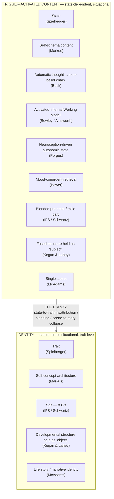
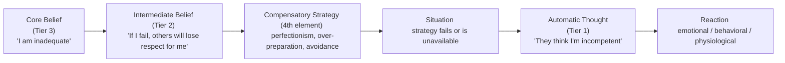

# Covenant Identity — Identity vs. Trigger-Activated Content — Psychological Frameworks Reference

*Practitioner reference and learning document — built for authorship reference and personal learning, not as a session tool, not client-facing, and not (yet) a formal CIC system component. Companion to [[Covenant Identity — Psychological Constructs — Reverse Connection Reference]], which performs a construct→CIC mapping for 24 other constructs across 9 domains. This document does the same preparatory theory work for one specific distinction — identity vs. what underlies a trigger event — in more depth than the Reverse Connection Reference's entry-per-construct format allows, and previews (without completing) the fuller construct-by-construct correspondence to CIC's own identity/lie-activation language.*

---

## The Core Distinction

There is a persistent and consequential confusion, both in lay self-understanding and in under-trained clinical/coaching practice, between **identity** — a superordinate, cross-situational, temporally stable self-representation — and **what underlies a trigger event**: state-dependent, context-activated material that fires under specific conditions and recedes when those conditions pass. The confusion runs in a specific direction: a person (or an under-trained helper) treats a state that got activated as though it were a fact about identity. Nine independent psychological literatures each name a version of this same structural error from a different angle. Taken together, they give a much more precise and defensible account of the distinction than any single framework provides alone.

### Visual Model — Where Each Framework Sits

The arrow running from the Trigger-Activated layer up into the Identity layer is the error itself, not a legitimate inference — it is what happens when a triggered state gets mistaken for a disclosure about identity. Every framework below names a version of that same wrongly-drawn arrow from its own vantage point.

---

## Framework 1 — Trait vs. State (Spielberger)

Spielberger's state-trait framework, built out originally for anxiety (the State-Trait Anxiety Inventory) but generalizable well beyond it, is the foundational distinction underneath all the others. A **trait** is a relatively stable disposition — how a person tends to respond across situations, on average, over time. A **state** is a transient condition — how a person is responding right now, given the current stimulus field. Identity operates at trait level (or higher, per Frameworks 8 and 9 below). A trigger event produces a state. The base-rate error every other framework elaborates on is inferring trait/identity from a single state observation — a self-applied version of the fundamental attribution error.

---

## Framework 2 — Self-Schema Theory (Markus)

Markus's self-schema theory supplies a middle layer that is easy to mistake for identity but is not the same thing. A **self-schema** is a chronically accessible cognitive structure about the self in a given domain (e.g., "I am someone who fails under pressure"). Schemas are more stable than a single state — they persist and get re-activated across many separate incidents — but they are still **content**: organized, retrievable, modifiable knowledge structures. Identity is closer to the architecture that contains and integrates multiple self-schemas into a coherent whole; a schema is one activatable piece of furniture inside that architecture, not the architecture itself.

---

## Framework 3 — Beck's Cognitive Model: Three Tiers, Plus the Piece Usually Left Out

This is the most operationalized and technique-rich of the nine frameworks, and the one most summaries — including compressed teaching versions — truncate to three tiers when the original clinical formulation tool has a fourth element that does real explanatory work. Origin: Aaron T. Beck's cognitive model of depression (1963, 1976), systematized into the clean teaching structure below by his daughter Judith S. Beck in *Cognitive Behavior Therapy: Basics and Beyond* (1995, rev. 2011).

**Tier 1 — Automatic Thoughts.** The surface-level, involuntary cognitions that fire in a specific situation, in real time, mostly below the threshold of deliberate reflection until a person is trained to notice them. They are situation-specific — tied to a particular stimulus, not a general claim about the self — and they are what a coach or clinician can actually elicit directly ("What went through your mind right when that happened?"). Example: *"They think I'm incompetent."* Automatic thoughts are the most numerous and most variable tier; dozens can fire across a single day, all traceable back to a much smaller number of Tier 2 and Tier 3 structures beneath them.

**Tier 2 — Intermediate Beliefs.** The underlying rules, attitudes, and conditional assumptions that generate the automatic thought — structured as "if-then" logic rather than flat self-statements. Example: *"If I make a mistake in front of someone, they will lose respect for me."* Intermediate beliefs are less situation-specific than automatic thoughts (the same rule generates automatic thoughts across many different situations), but they remain conditional — they only activate when their "if" clause is met — which is what makes them Tier 2 rather than Tier 3. The standard technique for surfacing an intermediate belief from an automatic thought is the **downward arrow technique** (Burns): repeatedly asking "if that were true, what would it mean?" until the conditional rule underneath the automatic thought becomes explicit.

**Failure mode, not covered by the summary above:** in practice, repeated "if that were true, what would it mean?" questioning frequently walks *past* Tier 2 and lands directly on Tier 3 — the question chases implication toward the most global consequence available, which is rarely the conditional rule itself. See [[Covenant Identity — Cognitive Diagnostic Fluency Curriculum]]'s Elicitation Technique section for the corrective lateral move (pivoting to the Compensatory Strategy question below, then reverse-engineering the rule from it) and its direct translation into Kegan & Lahey's four-column Immunity to Change architecture (Framework 8).

**Tier 3 — Core Beliefs.** The deepest, most absolute-sounding, unconditional, over-generalized schema-level statements about self, others, or the world. Example: *"I am inadequate."* Unlike Tier 2, core beliefs carry no "if" clause — they present themselves, subjectively, to the person holding them, as flatly and globally true. That is precisely what makes them feel identity-level even though they remain schema **content**, not the architecture that contains it. Continued downward-arrow laddering typically bottoms out here; there is nothing further underneath a core belief in this model — it is the floor of the cognitive chain, though not, as the next section clarifies, the floor of the fuller clinical formulation.

**The fourth element — Compensatory Strategies.** Beck's actual **Cognitive Conceptualization Diagram** (the full clinical formulation tool, as distinct from the three-tier teaching summary) places a fourth element between Tier 3 and Tier 1 that does substantial explanatory work: the behavioral patterns a person develops, often unconsciously, specifically to avoid ever activating the core belief in the first place. If the core belief is "I am inadequate," a compensatory strategy might be perfectionism, chronic over-preparation, or avoidance of any situation carrying evaluative risk. Compensatory strategies are why core beliefs can lie dormant for long stretches — the person has built a whole behavioral apparatus around never testing them — and why a trigger event that breaks through the compensatory strategy can feel so disproportionately intense: it is not merely activating an automatic thought, it is breaching a defense system that has been holding Tier 3 material at bay, in some cases for years.

Jeffrey Young — Beck's student, and the source of the Early Maladaptive Schema construct already in use elsewhere in this system (see [[Covenant Identity — Psychological Constructs — Reverse Connection Reference]]) — built schema therapy specifically because Beck's original short-term model wasn't holding for chronic, characterological patterns. What Young added beyond the schema taxonomy itself is the more relevant piece here: a formal typology of exactly three ways a person's compensatory strategy organizes itself in relation to a given core belief — **surrender** (living as if the belief is true, complying with its terms), **avoidance** (structuring life so the belief is never tested), and **overcompensation** (living as the opposite of the belief to disprove it). Each coping style is simultaneously an instance of Beck's fourth element (it is the standing behavioral apparatus) and an implicit statement of the missing Tier 2 rule (the coping style's own operating logic is an "if-then" — overcompensation runs on *"if I dominate, I cannot be exposed as weak"*; avoidance on *"if I stay unseen, I cannot be confirmed as too much"*; surrender on *"if I keep performing, I secure the love the wound made conditional"*). This is what makes Young's triad able to fill both missing rows in the Preview table below with one construct rather than two.

### Visual Model — The Full Cognitive Conceptualization Diagram

This fuller chain explains something the bare three-tier version cannot: why trigger events feel sudden and overwhelming rather than gradual. The person is not experiencing a slow slide down the tiers in real time — they are experiencing the failure of a compensatory strategy that had quietly been doing the work of keeping Tier 3 inactive, followed by a rapid cascade back up through automatic thought and reaction once that strategy stops holding.

**Scope note:** this whole model is a *cognitive*-channel account. It has direct affective, somatic, and relational analogs in Frameworks 4–7 below — Beck's core belief is functionally parallel to an Early Maladaptive Schema (which adds an affective/relational dimension Beck's model does not formally include), to an activated IFS exile's carried belief, and to an activated attachment Internal Working Model. Beck's model is unmatched for technique (downward arrow, thought records, behavioral experiments all attach cleanly to it) but narrower in scope — it does not on its own account for autonomic/polyvagal activation or relational-system activation, which is why the frameworks below are needed alongside it rather than as redundant restatements of the same thing.

---

## Framework 4 — Attachment Theory: Internal Working Models (Bowlby / Ainsworth)

Bowlby's attachment framework gives a mechanistic, developmental account rather than a purely cognitive one. **Internal Working Models (IWMs)** are relational schemas built from early caregiving experience — expectations about availability, responsiveness, and safety in relationship. Under conditions of perceived threat or relational rupture, the **attachment behavioral system** activates — proximity-seeking, protest, or (in avoidant strategies) deactivation. This is a systems-level activation, comparable to a thermostat engaging, not a disclosure of who the person fundamentally is. The IWM being activated may be old, distorted, and non-representative of the person's current relational reality; the trigger reveals *which* relational schema is wired to fire under *this* stimulus, not what is essentially true about the person.

---

## Framework 5 — Polyvagal Theory (Porges)

Porges's polyvagal theory adds the physiological floor beneath everything above it, and is important because it is the substrate that state-to-trait misattribution most often rides on. **Neuroception** — a subcortical, non-conscious threat-detection process — triggers autonomic state shifts (sympathetic mobilization, or dorsal vagal shutdown) *before* any conscious appraisal occurs. A person in a triggered dorsal or sympathetic state will generate cognitions and self-referential statements ("I'm worthless," "I can't do anything right") that feel identity-level but are in fact downstream narrative production layered on top of an autonomic state — the mind generating a story to match the body's condition, not the body confirming a story the mind already held.

---

## Framework 6 — Mood-Congruent / State-Dependent Processing (Bower)

Bower's research on mood-congruent memory and state-dependent processing shows that retrieval and interpretation are systematically biased toward content that matches the person's current physiological/affective state. A triggered state does not merely produce distorted thoughts incidentally — it actively recruits memory and interpretation to match itself, producing self-statements that feel self-evidently true precisely *because* they are internally consistent with the state, not because they are accurate about identity. This is the cognitive-science account of why a triggered episode can feel like clarity ("finally seeing the truth about myself") when it is closer to the opposite: a temporarily narrowed, state-matched retrieval window.

---

## Framework 7 — Internal Family Systems: Self vs. Parts (Schwartz)

IFS is worth naming distinctly because it builds the identity/trigger-content distinction directly into its structure rather than leaving it implicit, as Frameworks 1–6 do. **Self** (capital-S) is posited as a stable, non-damaged core characterized by qualities like calm, curiosity, compassion, and clarity (the "8 C's") — functionally analogous to identity as used throughout this document. A trigger event activates a **part** — a protector or exile carrying specific content (fear, shame, a belief, a strategy) from a specific history. The precise clinical term for the error under discussion here is **blending**: when a person is blended with a part, they experience the part's content as if it were the totality of who they are ("I am a failure") rather than as an activated part they *have* ("a part of me feels like a failure"). **Unblending** is the technical term for the exact differentiation this whole document is describing.

---

## Framework 8 — Constructive-Developmental Theory: Subject vs. Object (Kegan & Lahey)

Kegan and Lahey's subject-object distinction gives a developmental version of the same idea, and one already load-bearing elsewhere in the CIC system (see [[Covenant Identity — Identity-Before-Behavior Research Foundation]] and [[Covenant Identity — Deep Work Worksheets — Design Rationale]]). What a person is **subject to** is what they are fused with — embedded in, unable to see or reflect on, experienced as simply "how things are" rather than as one perspective among others. What a person can hold as **object** is what they can look at, evaluate, and act on. A trigger event often exposes what someone is currently subject to — an immature or under-developed structure of meaning-making that hijacks perception under stress — rather than exposing "who they are" at the level of identity. The developmental goal (the "subject-object shift") is making previously-subject material into object, which is structurally identical to the identity/trigger-content differentiation this document is built around: moving from "I am this reaction" to "I am someone who has this reaction, and can examine it."

---

## Framework 9 — Narrative Identity Theory: Scene vs. Story (McAdams)

McAdams's narrative identity theory, also already load-bearing in the CIC system (same two documents referenced above), supplies a useful governing metaphor for the error itself. Identity, in this model, is the internalized and evolving **life story** — an integrative narrative organizing past, present, and imagined future into a coherent sense of self. A triggering event is a single **scene** within that story. The distortion that happens under activation is **scene-to-story collapse** — treating one emotionally intense scene as though it rewrites or defines the entire narrative, rather than as one data point the larger story has to metabolize and contextualize. A person in an acutely triggered state routinely performs this collapse in real time ("this is who I am") when what is actually true is "this is a scene that activated old material."

---

## The Common Error Across All Nine Frameworks

Every framework above names a version of the same failure: **state-to-trait misattribution** (Spielberger's vocabulary), **overgeneralization** (Beck's), **blending** (Schwartz's), or **scene-to-story collapse** (McAdams's) — treating an activated state (fear, shame, an automatic thought, an activated schema, a blended protector part, a neuroception-driven autonomic shift) as evidence about identity, when what is actually happening is content specific to (a) the triggering stimulus, (b) the developmental structure activated, (c) the attachment/schema history activated, or (d) the current autonomic state. Separating "what is true about me" from "what got activated in me" is the single move all nine literatures are independently converging on, described from cognitive, developmental, attachment, physiological, and narrative vantage points respectively.

---

## Why the Distinction Matters for Intervention

The practical payoff of holding this distinction precisely is that it determines **where to intervene and on what timescale**. Identity-level work (schema restructuring across many exposures, narrative identity revision, core-belief modification) operates slowly and cumulatively, and is not resolved by managing any single triggered episode. Trigger-level work (autonomic regulation, cognitive defusion, unblending from an activated part, differentiating automatic thought from core belief in the moment) is fast, situational, and does not by itself change the standing structure that keeps generating the trigger. The error runs in both directions: over-scoping a triggered state into an identity crisis ("I clearly am fundamentally broken because I reacted this way") produces disproportionate, poorly targeted intervention; under-scoping a genuine identity-level pattern as "just a trigger to regulate" leaves the standing schema or narrative untouched, so the same activation recurs indefinitely under slightly different stimuli.

---

## Preview: Relationship to the CIC Architecture

CIC already has its own internal vocabulary for something structurally identical to the trait/state distinction above: a **covenant identity** (the person's declared, positional identity — objective, given, not self-generated or achieved) versus a **false identity** or **lie** (content activated under conditions of threat, shame, or old wound-pattern triggering, and mistaken in the moment for the truth about the self). This is a preview of the shape a full construct correspondence would take — it is **not** a completed mapping, and should be treated as a flagged future-development item, to be built out in the same reverse-lookup format as [[Covenant Identity — Psychological Constructs — Reverse Connection Reference]] if and when it is prioritized:

| Psychological Construct (this document) | Functional CIC Parallel |
|---|---|
| Beck's core belief / Markus's self-schema | CIC's **false identity / lie** — content-level, chronically accessible, distorted self-representation traceable to wound or conditioning history |
| Beck's automatic thought | The in-session verbal material a coach actually hears in the moment of activation — the surface symptom traced backward to the lie |
| IFS's Self / the stable trait-level identity | CIC's **covenant identity** — not negotiated, not built from evidence, not the product of the activated state; declared as objectively true independent of what is currently firing |
| Kegan's subject-object shift | The CIC diagnostic-naming move (Stage 2) — helping a client stop being *subject to* the lie (experiencing it as simply reality) and start holding it *as object* (seeing it as a lie, distinct from the true self it obscures) |
| Polyvagal / attachment-IWM activation | The mechanism-level account of *why* a character wound type (Warrior/Hermit/False Noble) fires under a specific trigger, independent of whether the client's covenant identity has anything to do with what is firing |
| Beck's intermediate belief (Tier 2) + compensatory strategy (4th element) / Young's coping-style triad (surrender / avoidance / overcompensation) | CIC's **Character Wound** types, read as the trait-level instantiation of the triad — Warrior (overcompensation), Hermit (avoidance), False Noble (surrender) — the standing behavioral-and-relational apparatus that keeps a given false identity/lie dormant until a trigger breaches it; the same triad operates per-incident as the "behavioral response" slot in Phase 3's Schema Interruption Practice activation sequence (trigger → somatic response → automatic thought → surrender/avoidance/overcompensation) |

---

## Related Documentation

- [[Covenant Identity — Cognitive Diagnostic Fluency Curriculum]] — practitioner learning curriculum built on Framework 3 (Beck) and the Young coping-style triad above as required Phase 1 reading; its Beck and Young diagrams here are recreated, alongside two further mappings (Burns, Kegan & Lahey) this document doesn't cover, in a companion HTML artifact: [Cognitive & Schema Diagnostic Taxonomy — Practitioner Reference](https://claude.ai/code/artifact/7f46fae3-832a-4d37-b203-8993f59ddbe8)
- [[Covenant Identity — Psychological Constructs — Reverse Connection Reference]] — companion construct→CIC mapping (24 constructs, 9 domains); this document supplies deeper theoretical treatment of the identity/trigger-activation distinction specifically, which that document's "Dysfunctional Core Beliefs" and "Cognitive Distortions" entries touch but do not expand
- [[Covenant Identity — Diagnostic Lens Transition Logic]] — Stage 4a (CBT-informed intervention) deploys Beck's downward arrow and thought-record techniques directly; Framework 3 above is the fuller theoretical account behind that stage's tool selection
- [[Covenant Identity — Identity-Before-Behavior Research Foundation]] — shares Kegan & Lahey and McAdams as contributors; that document establishes *why* identity precedes behavior change, this document gives the fuller psychological-construct grounding for the subject-object and narrative-identity mechanisms it invokes
- [[Covenant Identity — Deep Work Worksheets — Design Rationale]] — shares Young, Kegan & Lahey, and McAdams; that document is the applied schema/narrative-layer worksheet design, this document is the theoretical layer underneath it
- [[Covenant Identity — Character Wound Diagnostic Tool]] — Warrior/Hermit/False Noble as the CIC structural analog for attachment-classification activation (Framework 4)
- [[Covenant Identity — Practitioner Reference Index]] — navigation entry point; this document is indexed there under Theoretical Foundation

---

## Source Log

- Spielberger, C.D. — State-Trait Anxiety Inventory / state-trait theory
- Markus, H. — Self-schema theory (1977)
- Beck, A.T. — Cognitive theory of depression (1963, 1976)
- Beck, J.S. — *Cognitive Behavior Therapy: Basics and Beyond* (1995, rev. 2011) — Cognitive Conceptualization Diagram, three-tier teaching model, compensatory strategies
- Burns, D. — Downward arrow technique
- Young, J. — Schema therapy; Early Maladaptive Schemas; coping-style typology (surrender/avoidance/overcompensation)
- Bowlby, J. — Attachment theory, Internal Working Models
- Ainsworth, M. — Attachment classification (anxious/avoidant/disorganized)
- Porges, S. — Polyvagal theory, neuroception
- Bower, G.H. — Mood-congruent memory / state-dependent processing
- Schwartz, R. — Internal Family Systems (Self, parts, blending/unblending)
- Kegan, R. & Lahey, L. — Constructive-developmental theory, subject-object theory, Immunity to Change
- McAdams, D. — Narrative identity theory

*Built 2026-07-24 from a Claude conversation synthesizing established psychological literature at Andrew's request, for practitioner reference and personal learning — not yet used live with a client, not yet cross-checked against the full CIC construct correspondence.*
