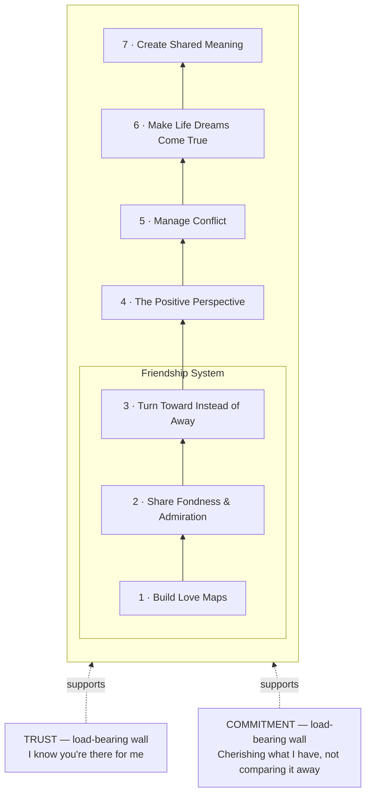

# The Sound Relationship House (Gottman)

John and Julie Gottman's model of what a stable, healthy marriage is built from: seven floors stacked bottom-to-top, flanked by two load-bearing walls. The lower floors support the upper ones — a couple cannot skip up to conflict management or shared meaning if the friendship floors underneath are unstable. Floors 1–3 together are called the **Friendship System**, which the Gottmans treat as the base the rest of the house depends on.

---

## The Seven Floors

### 1 · Build Love Maps
Active, current knowledge of your partner's inner psychological world — their history, worries, joys, present stresses, and hopes. This is not assumed familiarity from years together; it has to be kept updated, because a partner's inner world changes and an outdated map stops being accurate.

### 2 · Share Fondness and Admiration
Respect and affection that are actively noticed and voiced, not just privately felt. This is the direct antidote to **Contempt** (see Four Horsemen, below) — a relationship with a strong fondness-and-admiration floor has a reservoir of goodwill that contempt cannot easily erode.

### 3 · Turn Toward Instead of Away
Responding to a partner's **bids for connection** — small attempts to get attention, affection, or support — by engaging with them, rather than ignoring them (turning away) or meeting them with hostility (turning against). In Gottman's lab data, stable couples turned toward bids about 86% of the time; couples who later divorced did so about 33% of the time.

### 4 · The Positive Perspective
Also called **Positive Sentiment Override (PSO)**. When the Friendship System (floors 1–3) is solid, ambiguous or even mildly negative actions from a partner tend to get read charitably. Without it, a couple falls into **Negative Sentiment Override (NSO)**, where even neutral or well-intended actions get interpreted as further evidence of a problem.

### 5 · Manage Conflict
This floor holds the practical conflict skills, not conflict avoidance:
- **Accepting Influence** — genuinely letting a partner's opinions and emotions shape decisions, not just hearing them out
- **Softened (Gentle) Startup** — raising an issue as a specific complaint about a behavior, stated as your own feeling or need, instead of a character attack
- **Repair Attempts** — any statement or gesture meant to de-escalate mid-conflict (humor, a touch, "can we start over?"), and — just as important — the other partner's willingness to accept the repair attempt when it's offered
- **Physiological Self-Soothing** — recognizing flooding (elevated heart rate, stress hormones, loss of capacity to think clearly) and taking a real break, a minimum of about 20 minutes, before re-engaging
- **Distinguishing perpetual from solvable problems** — Gottman found roughly 69% of relationship conflict is perpetual (rooted in personality or values differences) rather than solvable through a one-time fix. A perpetual problem that calcifies — positions harden, humor disappears, no more progress — is what Gottman calls **gridlock**, and it is usually not about the surface issue but about an unspoken **dream within conflict**: a deeper personal need or life aspiration either partner is protecting without naming it.

### 6 · Make Life Dreams Come True
Creating an atmosphere where each partner can honestly disclose life hopes, values, and aspirations, and knows the other will not dismiss or block them — even ones that are inconvenient or that the other partner doesn't share.

### 7 · Create Shared Meaning
Shared rituals, roles, goals, and symbols that give the relationship (and, if applicable, the family) a sense of purpose larger than either individual — this is the top floor, and Gottman is explicit that it cannot substitute for a weak foundation below it.

---

## The Two Load-Bearing Walls

Trust and Commitment are not floors — they run the full height of the house on either side, holding the whole structure together rather than sitting at one level.

- **Trust** — the deep-seated belief that your partner is acting, and will continue to act, with your best interest at heart. Operationally: *"I know you're there for me."*
- **Commitment** — believing the relationship is a long-term pursuit, expressed behaviorally by cherishing the partner's positive qualities, nurturing gratitude for what exists rather than resentment for what's missing, and declining to make favorable comparisons to real or imagined alternative partners.

---

## Cross-reference: the Four Horsemen sit inside Floor 5

Criticism, Contempt, Defensiveness, and Stonewalling are the failure modes Gottman found predict divorce with high accuracy. Each has a named antidote, and each antidote is really a specific technique living on Floor 5 (Manage Conflict) or Floor 2 (Fondness and Admiration):

| Horseman | Antidote | Lives on |
|---|---|---|
| Criticism | Gentle/Softened Startup | Floor 5 |
| Contempt | Building a Culture of Appreciation | Floor 2 |
| Defensiveness | Taking Responsibility | Floor 5 |
| Stonewalling | Physiological Self-Soothing | Floor 5 |
